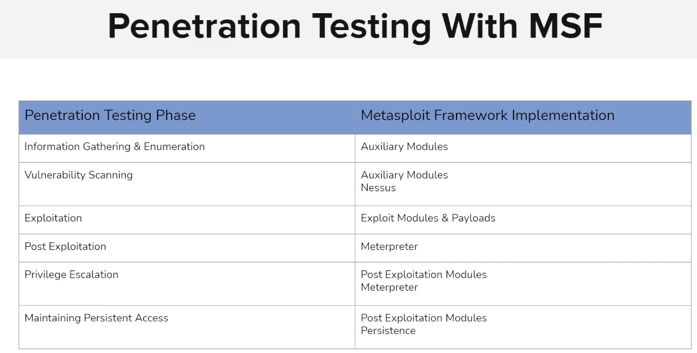

# Intro

## architecture

MSF modules:

- Exploit: các module để exploit

- Paylaod: các payload để tải lên khi xâm nhập vào máy khác

- Encoder: để encode tránh phần mềm nhận diện virus

- NOPS: 

- Auxiliary: module để scan và enum

