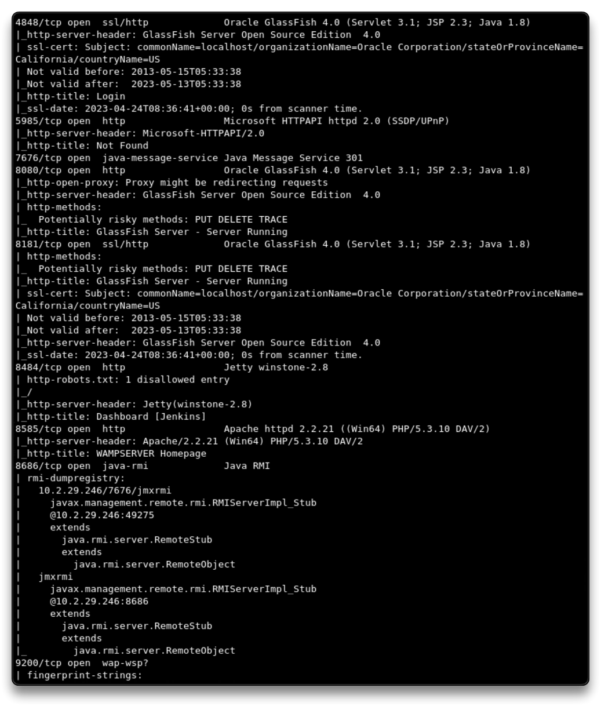
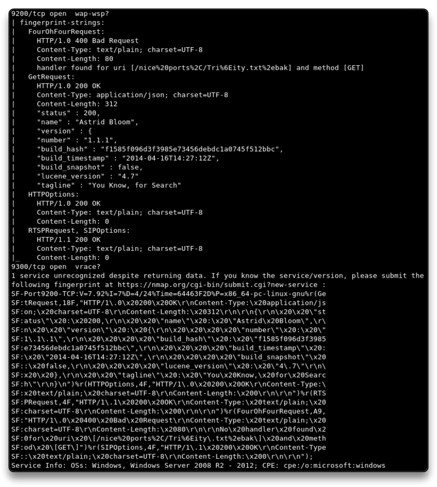
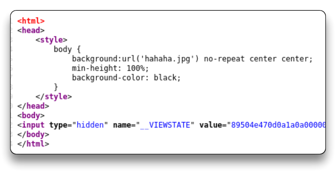
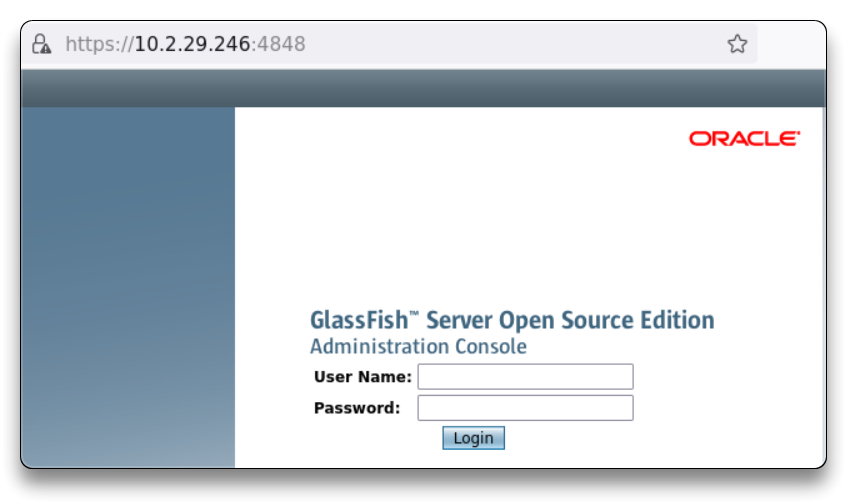
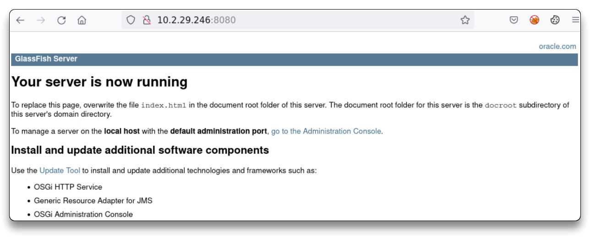
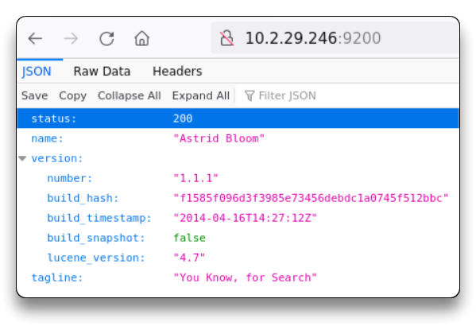
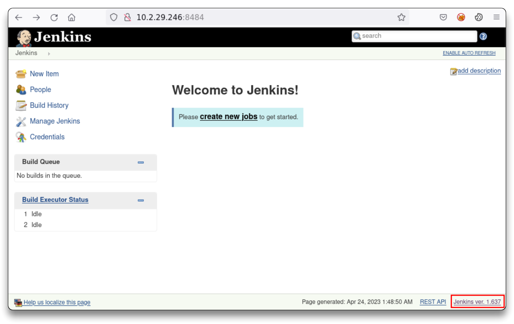
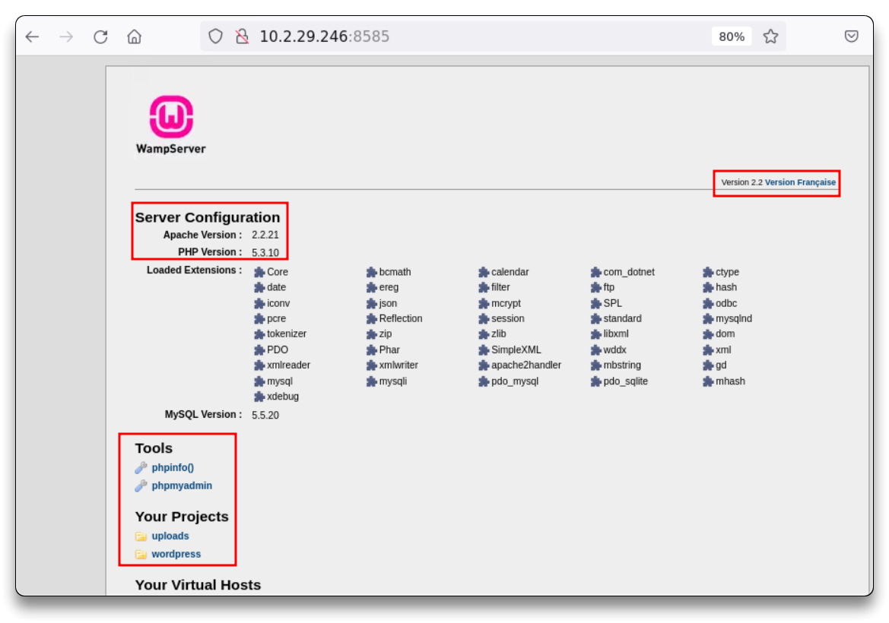
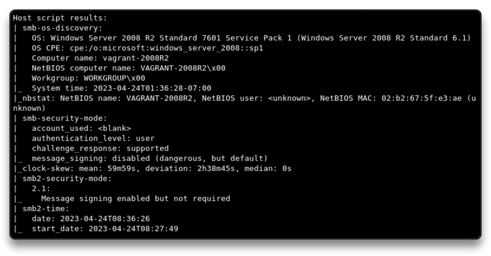

# Port Scanning & Enumeration - Windows

Lấy địa chỉ IP mục tiêu từ tệp `/etc/hosts`

`cat /etc/hosts`

	10.2.29.246 demo.ine.local

Ping thử đến IP vừa tìm được

`ping 10.2.29.246`

`ping demo.ine.local`

Tạo 1 folder lưu các thông tin pentest

`cd Desktop`

`mkdir Win2k8`

`cd WiWin2k8/` # To store all the notes and files about the target

### Port scanning with nmap

`nmap -sV 10.2.29.246` # Scans 1000 common ports

    21/tcp    open  ftp                  Microsoft ftpd
    22/tcp    open  ssh                  OpenSSH 7.1 (protocol 2.0)
    80/tcp    open  http                 Microsoft IIS httpd 7.5
    135/tcp   open  msrpc                Microsoft Windows RPC
    139/tcp   open  netbios-ssn          Microsoft Windows netbios-ssn
    445/tcp   open  microsoft-ds         Microsoft Windows Server 2008 R2 - 2012 microsoft-ds
    3306/tcp  open  mysql                MySQL 5.5.20-log
    4848/tcp  open  ssl/http             Oracle Glassfish Application Server
    7676/tcp  open  java-message-service Java Message Service 301
    8080/tcp  open  http                 Sun GlassFish Open Source Edition  4.0
    8181/tcp  open  ssl/http             Oracle GlassFish 4.0 (Servlet 3.1; JSP 2.3; Java 1.8)
    9200/tcp  open  wap-wsp?
    49152/tcp open  msrpc                Microsoft Windows RPC
    49153/tcp open  msrpc                Microsoft Windows RPC
    49154/tcp open  msrpc                Microsoft Windows RPC
    49155/tcp open  msrpc                Microsoft Windows RPC

    Service Info: OSs: Windows, Windows Server 2008 R2 - 2012; CPE: cpe:/o:microsoft:windows

Quét nâng cao 

`nmap -T4 -PA -sC -sV -p 1-10000 10.2.29.246 -oX nmap_10k`

    # -T4 = Aggressive speed scan
    # -PA = TCP ACK discovery
    # -sC = default NSE scripts
    # -sV = service version detection
    # -p 1-10000 = ports range
    # -oX = XML output file

    # A full port range scan can be also done, not necessary here
    # nmap -T4 -PA -sC -sV -p- 10.2.29.246 -oX nmap_all

Ngoài ra còn có thể có các lệnh

```
nmap -T4 -PA -sC -sV -p- 10.2.29.246 -oX nmap_all # quét tất cả cổng

nmap -sU -sV 10.2.29.246 -oX nmap_udp # quét UDP
```






Truy cập vào web

`http://10.2.29.246/`

`http://10.2.29.246/hahaha.jpg`

View page source



Thu thập banner trên một số dịch vụ

`nc -nv 10.2.29.246 21`

	220 Microsoft FTP Service

Other webpages

    https://10.2.29.246:4848/

    http://10.2.29.246:8080/

    http://10.2.29.246:9200/

    http://10.2.29.246:8484/

    http://10.2.29.246:8585/

        http://10.2.29.246:8585/wordpress/











### SMB Enumeration



nmap đưa ra 1 số gợi ý script chạy để thêm thông tin

MỞ MSF và thêm kết quả nmap vào

`service postgresql start && msfconsole`

`db_status`
`workspace -a Win2k8`
`setg RHOST 10.2.29.246`
`setg RHOSTS 10.2.29.246`
`db_import nmap_10k`

Scan SMB

`hosts`
`services`
`use auxiliary/scanner/smb/smb_version`
`run`
`hosts`


