# Host & Network Penetration Testing: Exploitation CTF 2

Câu 1: Có vẻ như người dùng SMB tên tom đã không thay đổi mật khẩu của mình trong một thời gian rất dài

`namp -sC -sV target.ine.local`

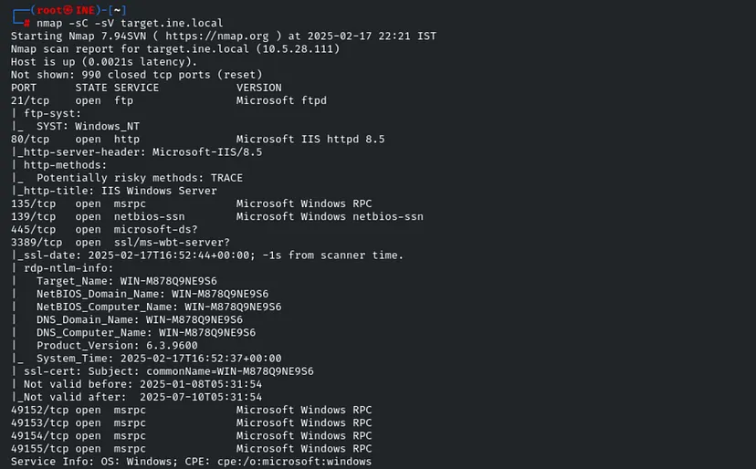

Ta thấy SMB đang chạy port 445

Ta sẽ brute-force người dùng tom

Chúng ta có thể sử dụng các công cụ như `Hydra`, `CrackMapExec` hoặc một mô-đun Metasploit để tấn công vét cạn mật khẩu, nhưng trong trường hợp này, chúng ta sẽ sử dụng `CrackMapExec`

`crackmapexec smb target.ine.local -u tom -p /usr/share/metasploit-framework/data/wordlists/unix_passwords.txt`

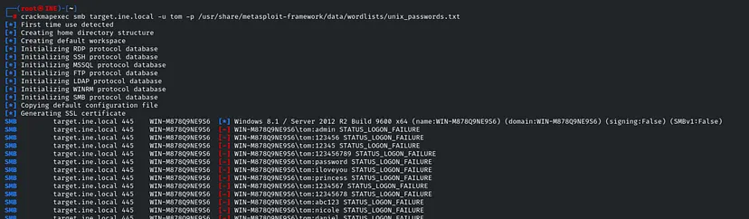

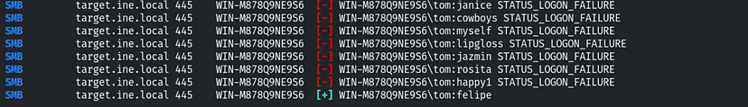

`smbmap -H target.ine.local -u tom -p felipe`

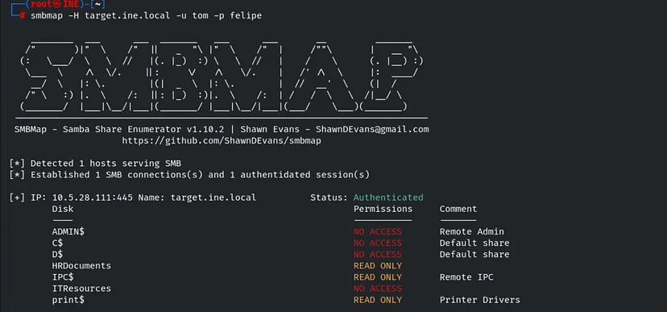

Ta thấy có 3 tài liệu có READ-ONLY, ta sẽ vào thử:

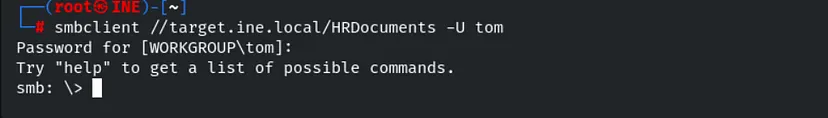

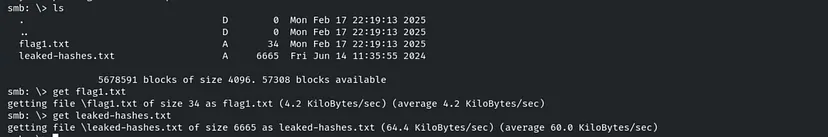

Câu 2. Sử dụng danh sách băm NTLM được tìm thấy trong thử thách trước, bạn có thể xâm nhập tài khoản người dùng smb `nancy` không?

ta thấy có `leaked-hashes.txt`

Kết nối SMB chỉ cần hash ko cần giải hash đó 

Dùng module `scanner/smb/smb_login`

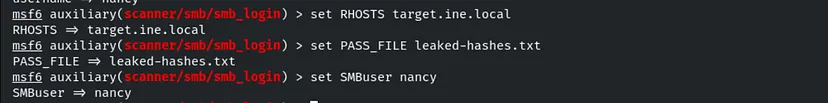

Ta có phiên

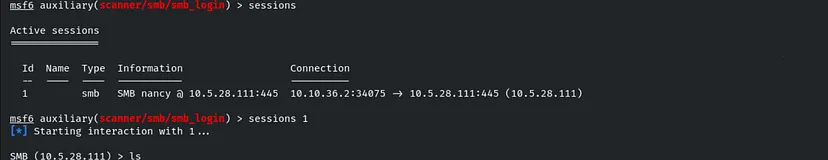

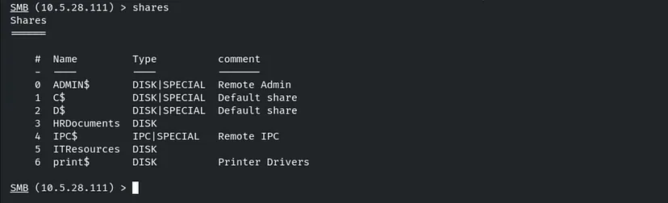

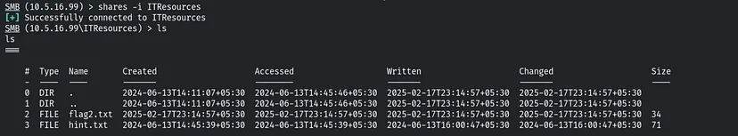

Download flag và hint

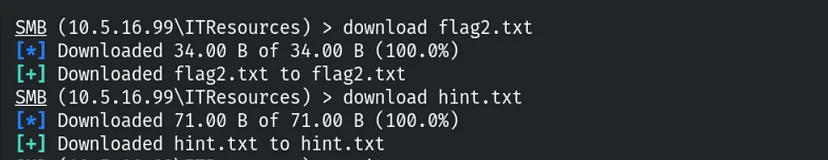

Câu 3. Tôi tự hỏi gợi ý tìm được trong thử thách trước có thể hữu ích cho việc gì!

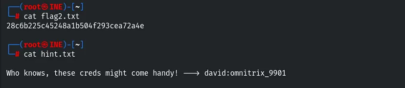

hint trả về 1 tài khoản

